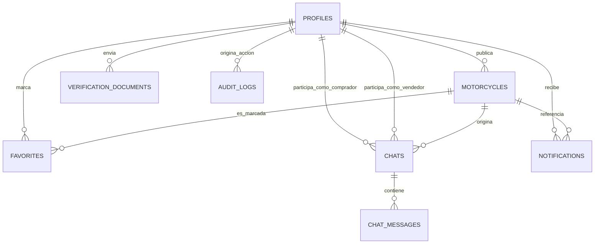

# UNIVERSIDAD NACIONAL DE SAN CRISTÓBAL DE HUAMANGA

**FACULTAD DE INGENIERÍA DE MINAS GEOLOGÍA Y CIVIL**
**ESCUELA PROFESIONAL DE INGENIERÍA DE SISTEMAS**

**Curso**
Pruebas y aseguramiento de la calidad de software

**Proyecto**
"MotoMarket: plataforma web de compra y venta de motocicletas para el mercado peruano, 2025"

PRESENTADO POR:
[Nombre completo del/los estudiante(s)]

DOCENTE:
Mg. Ing. Richard Zapata Casaverde

Ayacucho – Perú
2026

---

## Dedicatoria

Dedico el presente trabajo de investigación a mis padres, quienes han sido mi pilar
fundamental y me han brindado su apoyo constante a lo largo de mis estudios universitarios.
Este logro es fruto de su amor y sacrificio.

Asimismo, expreso mi gratitud a mis docentes, por su generosidad al compartir sus
enseñanzas y por fortalecer mis conocimientos durante mi formación profesional.

Finalmente, agradezco a mis amigos, por su compañía leal y su apoyo incondicional
en todo momento, quienes hicieron posible que hoy alcance esta meta.

---

## Agradecimiento

En primer lugar, agradezco a Dios, por haberme bendecido con la vida, guiar mi
camino y darme la fortaleza necesaria para perseverar y superar cada obstáculo a lo largo de
mi formación profesional.

A mi alma mater, la Universidad Nacional de San Cristóbal de Huamanga, y a todos
los docentes de la Escuela Profesional de Ingeniería de Sistemas, por su compromiso
académico y por haberme impartido los conocimientos que hoy constituyen los cimientos de
mi carrera.

Finalmente, mi gratitud eterna a mi familia. Gracias por ser mi ejemplo de esfuerzo,
por su amor incondicional y por haber creído siempre en mí. Su apoyo moral ha sido el motor
que me impulsó a cumplir este sueño. Este logro profesional es también suyo.

---

## Resumen

La presente investigación, de tipo aplicada y nivel descriptivo, tuvo como objetivo
general desarrollar una plataforma web de compra y venta de motocicletas nuevas y usadas
para el mercado peruano, materializada en un Producto Mínimo Viable (MVP) denominado
**MotoMarket**. Metodológicamente, se empleó un enfoque híbrido ágil, integrando el marco
de trabajo Scrum para la gestión iterativa de las fases de análisis, diseño e implementación,
junto con prácticas de Extreme Programming (XP) para asegurar la calidad del código. A
nivel arquitectónico, se construyó una Single Page Application (SPA) estructurada con
React.js en el frontend, Node.js con Express en el backend, y Supabase (PostgreSQL
gestionado, autenticación y almacenamiento de objetos) como plataforma de datos. La
evaluación de la plataforma se realizó mediante un diseño transversal enfocado en dos
variables. Respecto a la variable Funcionamiento, los resultados obtenidos a través de la
ejecución de una suite de pruebas automatizadas (unitarias y de integración con Jest y
Supertest) evidenciaron 250 pruebas superadas sobre 40 conjuntos de prueba (100% de éxito),
con una cobertura de código de 98.81% en sentencias, 97.78% en ramas, 98.19% en funciones
y 99.08% en líneas, sin presentar excepciones no controladas en los módulos críticos
(autenticación mediante JWT verificado con JWKS, publicación de motocicletas, búsqueda
parametrizada y moderación administrativa). Respecto a la variable Usabilidad, se diseñó y
documentó el instrumento de la Escala de Usabilidad del Sistema (SUS) para su aplicación a
una muestra piloto de usuarios reales; dicha evaluación empírica queda planteada como
actividad de validación a ejecutar en la siguiente fase del proyecto, dado que su alcance excede
el periodo cubierto por la presente documentación técnica. Se concluye que la plataforma
desarrollada constituye una solución tecnológica viable, segura y funcionalmente verificada
mediante evidencia automatizada, sentando bases operativas comprobadas para la
estructuración y formalización del comercio digital de motocicletas de segunda mano y
nuevas en el Perú.

**Palabras clave:** Plataforma web, Comercio electrónico C2C, Producto Mínimo
Viable, Scrum, React.js, Supabase, Motocicletas.

---

## Abstract

This applied and descriptive research aimed to develop a web platform for the buying
and selling of new and used motorcycles for the Peruvian market, materialized as a Minimum
Viable Product (MVP) called **MotoMarket**. Methodologically, a hybrid agile approach was
employed, integrating the Scrum framework for the iterative management of the analysis,
design, and implementation phases, along with Extreme Programming (XP) practices to
ensure code quality. At the architectural level, a Single Page Application (SPA) was built,
structured with React.js on the frontend, Node.js with Express on the backend, and Supabase
(managed PostgreSQL, authentication, and object storage) as the data platform. The
evaluation of the platform was carried out through a cross-sectional design focused on two
variables. Regarding the Functioning variable, the results obtained through the execution of
an automated test suite (unit and integration tests with Jest and Supertest) evidenced 250
passing tests across 40 test suites (100% success rate), with code coverage of 98.81% in
statements, 97.78% in branches, 98.19% in functions, and 99.08% in lines, without presenting
uncontrolled exceptions in the critical modules (JWT authentication verified via JWKS,
motorcycle publishing, parameterized search, and administrative moderation). Regarding the
Usability variable, the System Usability Scale (SUS) instrument was designed and
documented for application to a pilot sample of real users; this empirical evaluation is
proposed as a validation activity to be carried out in the next phase of the project, since its
scope exceeds the period covered by this technical documentation. It is concluded that the
developed platform constitutes a viable, secure, and functionally verified technological
solution backed by automated evidence, laying proven operational foundations for the
structuring and formalization of the digital trade of new and used motorcycles in Peru.

**Keywords:** Web platform, C2C E-commerce, Minimum Viable Product, Scrum,
React.js, Supabase, Motorcycles.

---

## Contenido

- [Dedicatoria](#dedicatoria)
- [Agradecimiento](#agradecimiento)
- [Resumen](#resumen)
- [Abstract](#abstract)
- [Introducción](#introducción)
- [Capítulo I — Planteamiento del Problema](#capítulo-i)
  - 1.1 Diagnóstico y enunciado del problema
  - 1.2 Formulación del problema
  - 1.3 Objetivos
  - 1.4 Hipótesis
  - 1.5 Justificación y delimitación de la investigación
- [Capítulo II — Marco Teórico](#capítulo-ii)
  - 2.1 Antecedentes de la investigación
  - 2.2 Marco teórico
- [Capítulo III — Material y Métodos](#capítulo-iii)
- [Capítulo IV — Resultados y Discusión](#capítulo-iv)
- [Capítulo V — Conclusiones y Recomendaciones](#capítulo-v)
- [Referencias bibliográficas](#referencias-bibliográficas)
- [Anexos](#anexos)

---

## Introducción

En la última década, la economía global ha experimentado una transformación radical
impulsada por la digitalización. Los mercados digitales han redefinido la manera en que se
intercambian bienes y servicios, reduciendo significativamente los costos de transacción y la
asimetría de información entre compradores y vendedores. Según Laudon y Traver (2020), los
sistemas de información y las plataformas web no solo facilitan el comercio, sino que se han
convertido en activos estratégicos indispensables para la supervivencia de los negocios en la
era contemporánea, permitiendo que la oferta y la demanda se encuentren en tiempo real sin
barreras geográficas.

En el contexto nacional, el Perú ha mostrado un crecimiento acelerado en la adopción
del comercio electrónico. De acuerdo con el reporte de la Cámara Peruana de Comercio
Electrónico (CAPECE, 2024), el volumen de ventas online en el país alcanzó cifras históricas,
impulsado por la masificación de los pagos digitales y el uso de dispositivos móviles. Dentro
de este ecosistema, el mercado de vehículos motorizados —y en particular el de
motocicletas— constituye uno de los rubros C2C (Consumer-to-Consumer) de mayor
movimiento económico del país, dado que la motocicleta es, para una parte significativa de la
población peruana, tanto un medio de transporte personal como una herramienta de trabajo
(mototaxis, delivery, reparto). Sin embargo, la intermediación de estas transacciones se realiza
mayoritariamente a través de plataformas generalistas —grupos de Facebook, Marketplace y
portales de clasificados de alcance regional no especializado— que no ofrecen filtros técnicos
propios del rubro (cilindraje, kilometraje, tipo de transmisión, año de fabricación), ni
mecanismos de verificación de la publicación, lo que genera desorganización de la
información, dificultad para comparar ofertas y una exposición constante a fraudes.

Frente a esta situación problemática, surge la pregunta de investigación principal:
¿Cuáles son los resultados del desarrollo de una plataforma web especializada en la compra y
venta de motocicletas nuevas y usadas para el mercado peruano, 2025? Para dar respuesta a
esta interrogante, el objetivo general del estudio es desarrollar e implementar dicha plataforma
web —MotoMarket— con el propósito de facilitar la conexión entre compradores y
vendedores de motocicletas, dotándolos de herramientas de búsqueda especializada, contacto
directo y asistencia mediante inteligencia artificial. De este se desprenden los objetivos
específicos, los cuales abarcan determinar los resultados de las fases de análisis, diseño e
implementación del software, para finalmente validar el correcto funcionamiento de los
módulos principales y evaluar la usabilidad de la plataforma mediante la participación de
usuarios reales.

La presente investigación se justifica desde una perspectiva tecnológica y social.
Prácticamente, provee una herramienta digital escalable (utilizando React.js, Node.js y
Supabase sobre PostgreSQL) que resuelve la fricción comunicacional y la desorganización del
comercio C2C de motocicletas. Socialmente, fomenta un entorno de transacciones más seguro
mediante el registro de identidades, la moderación administrativa de publicaciones y un
asistente conversacional que orienta al comprador antes de adquirir una moto usada.
Metodológicamente, demuestra la viabilidad de hibridar el marco de trabajo ágil Scrum con las
prácticas de ingeniería de Extreme Programming (XP), reforzadas con automatización de
pruebas de software, para la construcción de un producto de calidad verificable.

En cuanto a sus alcances y delimitaciones, el proyecto se enfoca en el desarrollo de un
Producto Mínimo Viable (MVP). Operativamente, la plataforma delega el cierre de
transacciones a la comunicación directa vía WhatsApp y al chat interno de la propia
plataforma, excluyendo la implementación de una pasarela de pagos nativa. A nivel de
validación, la evaluación de la variable de Funcionamiento se realizó mediante una suite de
pruebas automatizadas ejecutada sobre un proyecto real de Supabase en un entorno de pruebas
aislado (`NODE_ENV=test`), mientras que la evaluación de Usabilidad queda documentada
como instrumento listo para su aplicación empírica en la siguiente fase del proyecto.

A nivel metodológico, el estudio se enmarca en una investigación de tipo aplicada-
tecnológica, con un nivel descriptivo y un diseño no experimental de corte transversal. Las
técnicas de recolección de datos incluyeron el análisis documental del código fuente y de los
reportes de cobertura de pruebas para la validación del Funcionamiento (X4), y el diseño de la
Escala de Usabilidad del Sistema (SUS) como instrumento para la evaluación de la Usabilidad
(X5).

Finalmente, la estructura del documento se organiza en cinco capítulos: El Capítulo I
detalla el planteamiento del problema, los objetivos y la justificación. El Capítulo II desarrolla
el marco teórico, abarcando los antecedentes y las bases conceptuales de la ingeniería web y el
comercio electrónico. El Capítulo III describe el marco metodológico, el tipo de investigación
y la integración de las metodologías ágiles (Scrum y XP). El Capítulo IV expone los
resultados del desarrollo por Sprints y la discusión sobre la validación funcional automatizada
y la evaluación de la usabilidad. Por último, el Capítulo V presenta las conclusiones finales y
las recomendaciones para futuras líneas de trabajo.

---

## Capítulo I

### Planteamiento del Problema

#### 1.1 Diagnóstico y enunciado del problema

La economía digital se ha consolidado como el nuevo paradigma para el intercambio
comercial. A nivel global, la transición de los anuncios clasificados impresos hacia
plataformas digitales ha democratizado el acceso al mercado, permitiendo que cualquier
persona con acceso a internet pueda convertirse en ofertante. Según el informe digital global
de DataReportal (2024), más del 66% de la población mundial utiliza internet, y una gran
parte de esta interacción tiene fines comerciales.

En el Perú, el parque vehicular de motocicletas ha crecido de forma sostenida en la
última década, impulsado tanto por su bajo costo de adquisición y mantenimiento frente al
automóvil, como por su uso extendido en el transporte informal (mototaxi) y en los servicios
de reparto y delivery que se masificaron post-pandemia. Este crecimiento ha generado, en
paralelo, un mercado secundario (motos usadas) de gran dinamismo. Sin embargo, existe una
dicotomía tecnológica: mientras el parque de motocicletas crece, la oferta de plataformas
digitales especializadas para su compra-venta —a diferencia de lo que ocurre con los
automóviles, donde existen portales consolidados— sigue siendo escasa y poco especializada
en el mercado peruano.

El diagnóstico específico revela que el mercado de compra-venta de motocicletas ha
sido absorbido casi en su totalidad por redes sociales genéricas y portales de clasificados de
propósito general (bienes raíces, vehículos, empleos, servicios, todo mezclado en un mismo
listado). En estos espacios, la búsqueda de un vehículo con características técnicas precisas
(por ejemplo, "moto naked de 150cc a 200cc, año 2020 en adelante, hasta S/8,000, en Lima")
resulta ineficaz, dado que no existen filtros propios del rubro motociclístico como cilindraje,
tipo de combustible, transmisión o condición (nueva/usada).

Sin embargo, el uso de estas herramientas generalistas presenta deficiencias críticas
para un mercado que demanda especialización y confianza, las cuales se detallan a
continuación:

1. **Desorganización de la Información y Ausencia de Filtros Técnicos.** Las
   plataformas generalistas no contemplan atributos propios del dominio motociclístico. Un
   comprador interesado en una cilindrada específica, un tipo de transmisión (manual o
   automática) o un rango de kilometraje debe revisar manualmente decenas de publicaciones
   heterogéneas, mezcladas con anuncios de otros rubros, para encontrar un vehículo específico.

2. **Falta de Validación y Exposición a Estafas.** Al no existir un registro formal ni
   validación de identidad ni de la publicación en los grupos de redes sociales, cualquier
   individuo puede ofertar una motocicleta sin que exista un mecanismo que verifique al
   vendedor, lo que eleva el riesgo de estafas (publicaciones de vehículos inexistentes, solicitud
   de adelantos sin garantía, motos con papeles irregulares).

3. **Experiencia de Usuario (UX) Deficiente.** Las herramientas actuales carecen de las
   funcionalidades mínimas de un marketplace especializado: no cuentan con galerías de
   imágenes por publicación, ficha técnica estructurada, comparación de motos relacionadas, ni
   un canal de contacto directo con el vendedor integrado a la propia plataforma. Esto frustra la
   experiencia del comprador, desincentiva el consumo dentro del ecosistema formal y deriva en
   el uso de canales informales de menor seguridad.

La ausencia de una plataforma web dedicada y estructurada para la compra-venta de
motocicletas en el Perú genera consecuencias negativas tangibles tanto para el mercado como
para la sociedad:

- **Limitación del Alcance Comercial:** Los vendedores particulares y las pequeñas
  tiendas de motos pierden oportunidades de venta al no poder mostrar sus vehículos en un
  escaparate digital especializado, permanente y con ficha técnica estructurada.
- **Ineficiencia en el Mercado:** Los compradores invierten tiempo excesivo
  comparando publicaciones dispersas en distintos canales para tomar una decisión informada.
- **Inseguridad Digital:** La persistencia de transacciones en entornos no regulados
  facilita la proliferación de fraudes, ya que no existen mecanismos de verificación de
  publicaciones ni de moderación administrativa efectiva.

Ante este escenario, se identifica la necesidad de una solución tecnológica que,
aprovechando la alta penetración de internet móvil en el país, ofrezca un entorno
estructurado, seguro y usable, especializado en el dominio de las motocicletas. La propuesta
no pretende competir con los grandes marketplaces generalistas (Mercado Libre, OLX), sino
ofrecer una solución de nicho, con filtros y flujos de contacto diseñados específicamente para
este rubro, utilizando tecnologías modernas (React, Node.js y Supabase) que garanticen
rapidez, seguridad y escalabilidad.

En este sentido, se formula la siguiente interrogante principal que guía la
investigación: ¿Cuáles son los resultados del desarrollo de una plataforma web especializada
en la compra y venta de motocicletas nuevas y usadas para el mercado peruano, 2025?

#### 1.2 Formulación del Problema

##### 1.2.1 Problema General

¿Cuáles son los resultados del desarrollo de una plataforma web especializada en la
compra y venta de motocicletas nuevas y usadas para el mercado peruano, 2025?

##### 1.2.2 Problemas específicos

a. ¿Cuáles son los resultados de la fase de análisis del desarrollo de la plataforma web
   de compra y venta de motocicletas, 2025?
b. ¿Cuáles son los resultados de la fase de diseño del desarrollo de la plataforma web
   de compra y venta de motocicletas, 2025?
c. ¿Cuáles son los resultados de la implementación del desarrollo de la plataforma web
   de compra y venta de motocicletas, 2025?
d. ¿Cuáles son los resultados de la validación del correcto funcionamiento de los
   módulos principales de la plataforma web?
e. ¿Cuál es el nivel de usabilidad esperado de la plataforma web desarrollada, según el
   instrumento diseñado para su evaluación con usuarios piloto?

#### 1.3 Objetivos

##### 1.3.1 Objetivo General

Desarrollar una plataforma web especializada en la compra y venta de motocicletas
nuevas y usadas para el mercado peruano, con el propósito de facilitar la conexión entre
compradores y vendedores, promoviendo la formalización del comercio digital del rubro y
mejorando el acceso a ofertas y demandas especializadas.

##### 1.3.2 Objetivos Específicos

a. Determinar los resultados de la fase de análisis del desarrollo de la plataforma web
   de compra y venta de motocicletas, 2025.
b. Determinar los resultados de la fase de diseño del desarrollo de la plataforma web
   de compra y venta de motocicletas, 2025.
c. Determinar los resultados de la fase de implementación del desarrollo de la
   plataforma web de compra y venta de motocicletas, 2025.
d. Validar el correcto funcionamiento de los módulos principales de la plataforma web.
e. Diseñar el instrumento de evaluación de la usabilidad de la plataforma web
   desarrollada, para su posterior aplicación con usuarios piloto.

#### 1.4 Hipótesis

En el ámbito de la investigación científica, la formulación de hipótesis no constituye
un requisito universal y obligatorio, sino que obedece estrictamente al propósito y alcance
inicial del estudio. De acuerdo con Hernández-Sampieri et al. (2014), las hipótesis son
inherentes a las investigaciones cuantitativas cuyos enfoques son correlacionales o
explicativos. En el caso de los estudios con alcance descriptivo, la formulación de hipótesis
solo es pertinente si el investigador tiene la intención de pronosticar un dato, figura o hecho
específico.

Esta perspectiva metodológica es respaldada por Bernal (2016), quien sostiene que la
investigación de tipo descriptivo no requiere comprobar una suposición estructurada mediante
una hipótesis. En su lugar, el rigor y la dirección del estudio se sostienen en las preguntas de
investigación, las cuales se desprenden lógicamente del planteamiento del problema, los
objetivos trazados y el marco teórico que fundamenta el proyecto.

En coherencia con los lineamientos metodológicos citados, y dado que la presente
investigación posee un nivel puramente descriptivo orientado a determinar los resultados del
desarrollo tecnológico y evaluar el funcionamiento de una plataforma web, no se formuló una
hipótesis de investigación. El desarrollo del estudio y la validación de sus resultados están
guiados íntegramente por el cumplimiento de los objetivos específicos planteados.

#### 1.5 Justificación y Delimitación de la Investigación

##### 1.5.1 Importancia

La presente investigación reviste una importancia significativa al proponer una
solución tecnológica que moderniza la infraestructura comercial digital para un rubro con alta
demanda en el país. En un contexto donde la transformación digital es irreversible, dotar al
mercado peruano de motocicletas de una plataforma especializada significa dar un paso hacia
la formalización del comercio electrónico del sector. El proyecto trasciende el ejercicio
académico para convertirse en una herramienta de utilidad potencial que centraliza la oferta y
demanda especializada, reduciendo la brecha entre la informalidad de las redes sociales y un
ecosistema digital estructurado.

##### 1.5.2 Justificación

**1.5.2.1. Justificación Social.** Socialmente, la investigación busca mejorar la
experiencia de compra y venta de motocicletas al ofrecer un entorno digital más seguro y
organizado. Al implementar un módulo de verificación de identidad y moderación
administrativa de publicaciones, se contribuye a mitigar el riesgo de estafas comunes en
canales informales, promoviendo una cultura de confianza digital entre compradores y
vendedores.

**1.5.2.2 Justificación Económica.** El impacto económico es directo. La plataforma
actúa como un catalizador para vendedores particulares y pequeños comercios de motos,
reduciendo los "costos de transacción" (tiempo y dinero) asociados a la búsqueda y difusión de
información. Para los vendedores, MotoMarket representa un canal de venta con mayor
alcance, permanencia y filtros especializados que las redes sociales genéricas.

**1.5.2.3. Justificación técnica.** Desde la perspectiva de la Ingeniería de Sistemas,
este proyecto se justifica por la implementación de una arquitectura de software moderna y
desacoplada. El desarrollo utilizando React.js en el frontend y Node.js/Express en el backend
permite crear una Single Page Application (SPA) de alto rendimiento. Asimismo, el uso de
**Supabase** —una plataforma de backend como servicio (BaaS) construida sobre PostgreSQL—
para la persistencia, autenticación y almacenamiento de imágenes, permite delegar en
infraestructura administrada aspectos críticos de seguridad (emisión y verificación de tokens
JWT, políticas de seguridad a nivel de fila) sin sacrificar el control de la lógica de negocio, que
permanece centralizada en el backend propio. La aplicación de una metodología ágil híbrida
(Scrum + XP), reforzada con una suite de pruebas automatizadas, justifica el enfoque de
mejora continua y de calidad verificable del software entregado.

##### 1.5.3 Delimitación

**1.5.3.1. Delimitación Espacial.** El estudio y la implementación del software se
orientan al mercado peruano de compra-venta de motocicletas, sin restringirse a una única
región; el catálogo contempla publicaciones de motocicletas ubicadas en distintas ciudades del
país (Lima, Arequipa, Trujillo, Cusco, Ayacucho, Chiclayo, Piura, entre otras).

**1.5.3.2. Delimitación Temporal.** La investigación abarca el periodo 2025-2026,
considerando las fases de análisis, diseño, desarrollo y validación técnica de la plataforma.

**1.5.3.3. Delimitación Temática.** El proyecto se enmarca en la línea de investigación
de Ingeniería de Software y Sistemas de Información, específicamente en el desarrollo de
aplicaciones web, aseguramiento de la calidad mediante pruebas automatizadas, y tecnologías
de comercio electrónico especializado.

##### 1.5.4 Limitaciones

A pesar de la planificación rigurosa y el sustento teórico del proyecto, se reconocen
ciertas restricciones de carácter técnico, metodológico y contextual que delimitan el alcance
del presente estudio:

**1.5.4.1. Alcance funcional acotado al MVP:** El desarrollo del software se enfoca
estrictamente en la entrega de un Producto Mínimo Viable con las funcionalidades esenciales
(registro y autenticación por rol, publicación y búsqueda de motocicletas, favoritos, chat
directo, notificaciones, estadísticas por rol, verificación de identidad y moderación
administrativa). Quedan fuera del alcance de esta investigación características avanzadas
como pasarelas de pago integradas o el desarrollo de una aplicación móvil nativa.

**1.5.4.2. Validación de usabilidad pendiente de ejecución empírica.** El instrumento
de Usabilidad (Escala SUS) fue diseñado y documentado en su totalidad, pero su aplicación a
una muestra real de usuarios piloto no fue ejecutada dentro del periodo cubierto por esta
documentación técnica, por lo que se plantea como actividad de validación a completar en la
siguiente fase del proyecto.

**1.5.4.3. Ausencia de validación en entorno real de producción.** La plataforma ha
sido desarrollada y verificada funcionalmente mediante pruebas automatizadas ejecutadas
contra un proyecto de Supabase de pruebas; durante este periodo no se ha medido el
comportamiento del sistema frente a tráfico real o picos de concurrencia en producción.

**1.5.4.4. Dependencia de tecnologías en constante evolución.** El stack tecnológico
utilizado (React 19, Node.js, Supabase) se encuentra en permanente actualización, lo que
eventualmente podría requerir refactorización futura para mantener su compatibilidad.

**1.5.4.5. Dependencia de servicios externos de terceros.** El asistente convershappedvirtual
"Tico" depende de la disponibilidad de proveedores externos de inteligencia artificial (Google
Gemini o Groq); si ninguna clave de API está configurada, el sistema recurre a un modo de
respuesta simulada predefinida para no interrumpir la experiencia del usuario.

---

## Capítulo II

### Marco Teórico

#### 2.1 Antecedentes de la Investigación

##### 2.1.1 Antecedentes Nacionales

En el contexto peruano, diversos autores han propuesto soluciones tecnológicas para
descentralizar el comercio electrónico y especializar la oferta digital por rubro.

Chavez Minaya (2024), en su tesis "Implementación de un sitio web de comercio
electrónico para mejorar las ventas en La Tienda Switech – Huaraz; 2024", sustentada en la
Universidad Católica Los Ángeles de Chimbote (ULADECH), abordó la problemática de la
comercialización informal y la desorganización de la información en un contexto provincial.
El estudio concluyó que la implementación de una arquitectura web centralizada mejora
significativamente el control y la satisfacción de los clientes, lo cual guarda relación directa
con la presente investigación, dado que demuestra el impacto de migrar de canales informales
a plataformas propias.

Orihuela Sucasaire (2024), en su investigación titulada "Uso de plataforma
Marketplace Facebook y su impacto en las ventas personales", presentada en la Universidad
Peruana Unión (UPeU), diagnosticó empíricamente el entorno informal de Facebook
Marketplace como canal de venta en el Perú. Este antecedente resulta fundamental para
MotoMarket, ya que justifica la necesidad metodológica y tecnológica de migrar hacia una
plataforma propia, segura y especializada, que mitigue las fricciones comerciales derivadas de
las redes sociales genéricas —exactamente el mismo fenómeno que afecta hoy a la compra-
venta de motocicletas en el país.

Encalada y Gómez (2022), en su tesis "Profesionales Perú: Plataforma digital para
publicar anuncios de servicios profesionales y oficios", presentan una solución tecnológica
similar en su naturaleza C2C, orientada a un rubro distinto (servicios profesionales), pero que
valida la viabilidad de negocio de plataformas verticales especializadas frente a los
clasificados generalistas, tal como MotoMarket lo hace para el rubro motociclístico.

Sánchez y Vergara (2021), en su tesis "Plataforma digital y su influencia en la
distribución de multiservicios profesionales", desarrollaron "ContactMe", una plataforma web
orientada a optimizar la conexión entre proveedores de servicios y clientes, alcanzando una
satisfacción de uso superior al 80%, lo cual respalda empíricamente que un canal de contacto
directo (como el chat interno y la redirección a WhatsApp implementados en MotoMarket)
incrementa significativamente la satisfacción del usuario final.

##### 2.1.2 Antecedentes internacionales

En el ámbito internacional, se han identificado estudios que validan la necesidad de
plataformas de intermediación digital especializadas para dinamizar mercados de nicho.

Pastor (2024), en su trabajo de fin de grado "Desarrollo de una plataforma de
anuncios clasificados BEEFRIP", se centra en la creación de una plataforma de anuncios
clasificados orientada a facilitar la publicación, búsqueda y visibilidad de servicios y negocios,
validando el patrón de marketplace especializado como solución segura e innovadora que se
adapta a las necesidades actuales del mercado, un patrón directamente replicado en la
arquitectura de catálogo y publicación de MotoMarket.

Calvache (2023), en su trabajo "Implementación de una página web para la
promoción y gestión de arriendos en la ciudad de Guaranda, año 2023", desarrolló una
plataforma vertical (alojamientos) enfocada en una comunidad específica, concluyendo que la
centralización de la oferta en un entorno digital propio mejora significativamente la
experiencia de búsqueda y optimiza la difusión de las publicaciones para los ofertantes —
principio de diseño equivalente al aplicado en el catálogo filtrable de MotoMarket.

Asimismo, Rojas León (2016) presentó en la Universidad Nacional de Loja su tesis
"Desarrollo de una aplicación web para anuncios clasificados de productos y servicios para la
ciudadanía lojana, utilizando herramientas libres", demostrando la viabilidad de implementar
soluciones web de clasificados con software libre, aportando un modelo replicable en
contextos donde se busca formalizar y optimizar el comercio digital, como es el caso del
presente proyecto con su stack basado íntegramente en tecnologías de código abierto (React,
Node.js, PostgreSQL).

#### 2.2 Marco teórico

##### 2.2.1 Página Web

Una página web es un documento accesible a través de Internet o la World Wide Web
(WWW), desarrollado con un lenguaje de programación específico, como HTML, que sigue
estándares determinados. Aunque su uso es común en la actualidad, muchas personas
desconocen su funcionamiento técnico.

El acceso a estos sitios se realiza mediante navegadores web, los cuales interpretan el
código del documento y presentan la información visualmente al usuario. En una página web
es posible encontrar textos, imágenes, enlaces a otros sitios, así como elementos interactivos
como animaciones y sonidos.

Para estar disponible en línea, una página web necesita un espacio de almacenamiento
donde alojarse. Cuando un usuario solicita acceder a ella, el contenido se carga desde un
servidor web o host, que actúa como un ordenador de gran capacidad encargado de distribuir
la información a través de la red. Este servicio de almacenamiento se conoce como hosting
(Begoña, 2019).

###### 2.2.1.1 Tipos de Páginas Web

Existen principalmente dos tipos de páginas web: estáticas y dinámicas. Las páginas
estáticas presentan contenido fijo que no permite actualizaciones frecuentes. Por otro lado, las
páginas dinámicas pueden desarrollarse en HTML u otros lenguajes, lo que facilita la
interacción en tiempo real. Este tipo de páginas es ideal para sitios que requieren
actualizaciones constantes y participación activa de los usuarios, como los marketplaces C2C
(Begoña, 2019).

###### 2.2.1.2 Página web Estática

Según López (2021), una página web estática se caracteriza por tener un contenido fijo
que no cambia a menos que se modifique manualmente el código fuente. Su estructura incluye
elementos básicos como textos, imágenes y formularios, permitiendo una interacción limitada.
Según Herrera (2023), estos sitios pueden diseñarse utilizando únicamente HTML, CSS y
JavaScript, sin necesidad de emplear lenguajes de programación del lado del servidor.

###### 2.2.1.3 Página web Dinámica

Según López (2021), una página web dinámica se caracteriza por su interactividad y
funcionalidad, a diferencia de las páginas estáticas que son mayormente informativas. Para
lograrlo, utiliza lenguajes de programación y bases de datos que permiten que los usuarios
interactúen con la información presentada. Su funcionamiento se basa en dos tipos de
programación: front-end, que usa JavaScript ejecutado en el navegador, y back-end, que
emplea lenguajes como JavaScript (Node.js), Python o similares en el servidor. Según Mora
(2024), una página web dinámica adapta su contenido en función de distintos factores, como la
ubicación del usuario o su historial de interacción en el sitio, empleando lenguajes de
programación del lado del servidor conectados a una base de datos para ofrecer
funcionalidades interactivas. MotoMarket constituye un ejemplo íntegro de este paradigma: el
catálogo, los filtros, el chat y las notificaciones se generan y actualizan dinámicamente a partir
del estado almacenado en la base de datos.

##### 2.2.2 Aplicaciones de Página Única (SPA)

En la evolución de la ingeniería web, la arquitectura de Aplicación de Página Única
(SPA, por sus siglas en inglés *Single Page Application*) representa un cambio de paradigma
respecto a las aplicaciones web tradicionales o de múltiples páginas (MPA). Según Mikowski
y Powell (2014), una SPA se define como una aplicación web que entrega al usuario una
experiencia fluida y similar a la de una aplicación de escritorio, cargando una única página
HTML (conocida como *shell* o caparazón) y actualizando dinámicamente el contenido
conforme el usuario interactúa con la interfaz, sin necesidad de recargar la página completa en
cada solicitud.

El funcionamiento técnico de una SPA se basa en el traslado de la lógica de
presentación del servidor al cliente (navegador). Flanagan (2020) explica que, en lugar de
recibir documentos HTML completos del servidor ante cada clic, el navegador carga
inicialmente los recursos estáticos (HTML, CSS y JavaScript base) una sola vez.
Posteriormente, las interacciones del usuario disparan solicitudes asíncronas que únicamente
transfieren datos en formato JSON. El motor de JavaScript del navegador toma estos datos y
actualiza el Modelo de Objetos del Documento (DOM) en tiempo real.

Esta arquitectura ofrece ventajas significativas para el desarrollo de plataformas
interactivas como MotoMarket. Banks y Porcello (2020) destacan que las SPA reducen
drásticamente el consumo de ancho de banda tras la carga inicial y mejoran la "sensación de
velocidad" (performance percibida), ya que la interfaz reacciona casi instantáneamente. En el
caso concreto de la plataforma desarrollada, la navegación entre el catálogo filtrable, el detalle
de una motocicleta y el panel privado del usuario se realiza mediante enrutamiento del lado del
cliente (React Router), sin recargas de página completas.

##### 2.2.3 Comercio Electrónico

El comercio electrónico (*e-commerce*) ha trascendido su definición inicial de venta
por internet para convertirse en un ecosistema complejo de interacciones digitales. Laudon y
Traver (2021) definen el comercio electrónico como el uso de Internet, la Web y aplicaciones
móviles para realizar transacciones comerciales. A diferencia del comercio tradicional, este
modelo elimina las barreras temporales y espaciales, permitiendo la "ubicuidad"; es decir, la
capacidad de comprar y vender en cualquier momento y desde cualquier lugar, lo que reduce
significativamente los costos de transacción para los participantes del mercado.

###### 2.2.3.1 Modelo C2C (Consumidor a Consumidor)

Dentro de las categorías del comercio electrónico, el presente estudio se enmarca en el
modelo Consumidor a Consumidor (C2C). Según Chaffey y Ellis-Chadwick (2019), el
modelo C2C se caracteriza por facilitar transacciones comerciales directamente entre
particulares, donde la plataforma digital no actúa como vendedor ni propietario de los bienes,
sino como un intermediario tecnológico que provee la infraestructura, las reglas de negocio y
los mecanismos de confianza necesarios para que la transacción ocurra.

Este modelo es particularmente relevante para la venta de vehículos de segunda mano.
Turban et al. (2018) explican que el éxito de un modelo C2C depende críticamente de la "masa
crítica" de usuarios y de la capacidad del sistema para gestionar la reputación y la búsqueda de
información. En el contexto de esta investigación, MotoMarket actúa como el *market maker*
(creador de mercado) digital para el comercio de motocicletas en el Perú, formalizando
interacciones que actualmente ocurren de manera dispersa en redes sociales, e incorporando
además un rol diferenciado de "vendedor" —que puede representar tanto a una persona natural
como a una pequeña tienda de motos— con un panel de gestión de inventario propio.

##### 2.2.4 Anuncios Clasificados Digitales

Los anuncios clasificados digitales representan la evolución tecnológica de los
tradicionales avisos breves en prensa escrita. Según Strauss y Frost (2016), se definen como
mensajes publicitarios estructurados, generalmente cortos y agrupados por categorías
específicas, diseñados para conectar directamente a ofertantes y demandantes en un entorno
online. A diferencia de la publicidad *display* (banners), los clasificados son proactivos: el
usuario acude a ellos intencionalmente buscando solucionar una necesidad específica.

La migración de este formato al entorno web ha transformado su dinámica. Laudon y
Traver (2021) señalan que la principal ventaja de los clasificados digitales sobre sus
contrapartes impresas es la capacidad de búsqueda y filtrado. Las plataformas digitales
permiten indexar el contenido mediante metadatos (marca, modelo, año, cilindraje, precio,
ubicación), facilitando la recuperación instantánea de información relevante. En MotoMarket,
cada publicación de motocicleta se enriquece con una galería de imágenes, ficha técnica
estructurada (cilindraje, kilometraje, combustible, transmisión) y geolocalización aproximada,
lo que reduce la incertidumbre del comprador y acelera la toma de decisiones.

##### 2.2.5 Framework Scrum

Scrum es un marco de trabajo ágil para el desarrollo de productos, servicios u otro
entregable, aplicable para proyectos de cualquier complejidad e industria. Diseñado para
ofrecer valor de forma rápida a lo largo del proyecto (SCRUMstudy, 2022).

"Scrum es un marco de trabajo y no pretende ser prescriptivo, lo cual significa que hay
espacio para la flexibilidad en su aplicación" (SCRUMstudy, 2022, p. 25).

###### 2.2.5.1 Principios de Scrum

Según SCRUMstudy (2022), Scrum cuenta con 6 lineamientos básicos que deben
cumplirse para garantizar la aplicación efectiva del marco de trabajo:

1. **Control del proceso empírico:** indica que ante problemas o soluciones no
   definidas se aprende por medio de la experimentación. Se basa en 3 ideas principales:
   - **Transparencia:** promueve el acceso fácil y transparente a la información,
     reflejada en la socialización de la visión del proyecto, un backlog priorizado, cronogramas de
     liberación y reuniones de planificación, revisión y retrospectiva del sprint.
   - **Inspección:** el uso de radiadores de información que visibilizan el progreso del
     equipo, junto con la validación y aprobación de entregables por el product owner.
   - **Adaptación:** el equipo Scrum se adapta a realizar mejoras según el avance del
     desarrollo del producto, documentando lecciones aprendidas en cada retrospectiva.
2. **Autoorganización:** equipos con sentido de compromiso y responsabilidad que se
   autoorganizan ofrecen mucho más valor.
3. **Colaboración:** fomenta la creación de valor compartido entre el equipo, el cliente
   y los interesados.
4. **Priorización basada en valor:** busca ofrecer el máximo valor al negocio en el
   menor tiempo posible.
5. **Time-boxing:** práctica que consiste en la asignación de un intervalo de tiempo
   fijo para cada proceso dentro del proyecto (Sprint, Daily Standup, revisión y retrospectiva).
6. **Desarrollo iterativo:** permite que los cambios sugeridos por el cliente sean
   incluidos en el proyecto y posibilita la corrección del rumbo.

###### 2.2.5.2 Roles de Scrum

Los roles principales de Scrum, obligatorios y responsables del cumplimiento de los
objetivos del proyecto, son el **Product Owner** (responsable de aterrizar los requerimientos
del cliente), el **Scrum Master** (vela por el bienestar del equipo y guía la aplicación de las
prácticas de Scrum) y el **Equipo Scrum** (grupo de personas responsables de entender y crear
los entregables del proyecto) (SCRUMstudy, 2022).

###### 2.2.5.3 Fases y procesos de Scrum

Según SCRUMstudy (2022), Scrum organiza diecinueve procesos iterativos en cinco
fases: **Inicio** (creación de la visión, formación del equipo, backlog inicial), **Planificación y
estimación** (historias de usuario, estimación, backlog del sprint), **Implementación** (creación
de entregables, Daily Standup, refinamiento del backlog), **Revisión y retrospectiva**
(demostración y validación del sprint, lecciones aprendidas) y **Liberación** (envío de
entregables y retrospectiva de liberación).

##### 2.2.6 Entorno de Ejecución Node.js

Node.js representa un hito en el desarrollo web al permitir el uso de JavaScript fuera
del navegador. Según Herron (2020), se define técnicamente como un entorno de ejecución
(*runtime environment*) multiplataforma de código abierto, construido sobre el motor de
JavaScript V8 de Google Chrome. Esta característica es fundamental, ya que el motor V8
compila el código JavaScript directamente a código máquina nativo, otorgándole una
velocidad de ejecución superior en comparación con lenguajes interpretados tradicionales.

La arquitectura de Node.js difiere radicalmente de los modelos de servidor
tradicionales basados en hilos (*threads*). Cantelon et al. (2017) explican que Node.js opera
sobre un único hilo de ejecución (*single-threaded*) utilizando un modelo de entrada/salida
(I/O) no bloqueante y orientado a eventos. En términos prácticos, esto significa que cuando la
API de MotoMarket realiza una operación de red hacia Supabase (por ejemplo, consultar el
catálogo de motocicletas), el servidor no se "congela" esperando la respuesta; en su lugar,
delega la tarea y continúa procesando otras solicitudes de usuarios, reintroduciendo la tarea en
el bucle de eventos (*Event Loop*) cuando la respuesta está disponible.

Para el presente proyecto, el uso de Node.js con el framework **Express** se justifica por
su capacidad para manejar un alto volumen de conexiones concurrentes con un consumo de
recursos mínimo. Además, al utilizar JavaScript tanto en el frontend (React) como en el
backend (Node.js), se unifica el lenguaje de desarrollo, facilitando el intercambio de datos en
formato nativo JSON sin necesidad de conversiones costosas.

##### 2.2.7 Librería React.js y el Virtual DOM

React.js es una tecnología fundamental en el desarrollo de interfaces de usuario
modernas. Banks y Porcello (2020) la definen técnicamente como una librería de JavaScript de
código abierto creada por Facebook (Meta), centrada en la construcción de interfaces de
usuario mediante una arquitectura basada en componentes. React introduce el concepto de
JSX, permitiendo encapsular la estructura y la lógica en pequeñas unidades reutilizables y
autónomas llamadas componentes —patrón aplicado extensamente en MotoMarket a través de
componentes como la tarjeta de motocicleta, el modal de detalle o la barra de notificaciones,
reutilizados en múltiples vistas.

La innovación más disruptiva de React, y que justifica su elección para este proyecto,
es el mecanismo del **Virtual DOM**. Según Boduch y Derks (2020), el DOM tradicional del
navegador es costoso de manipular en términos de rendimiento; React soluciona esto
manteniendo una copia ligera y en memoria del DOM real. El proceso de actualización,
denominado **Reconciliación**, funciona así: (1) cuando cambia el estado de un componente
—por ejemplo, al aplicar un filtro en el catálogo—, React crea un nuevo árbol de Virtual DOM;
(2) un algoritmo de diferenciación (*diffing algorithm*) compara este nuevo árbol con la
versión anterior; (3) React actualiza el DOM real modificando únicamente los nodos que
cambiaron, sin recargar el resto de la interfaz. Wieruch (2020) sostiene que esta eficiencia es
crítica para aplicaciones ricas en datos, asegurando que la interacción (búsquedas, filtros,
paginación) se sienta instantánea incluso en dispositivos móviles con recursos limitados.

##### 2.2.8 Supabase y PostgreSQL como plataforma de datos

Frente a la alternativa de administrar un servidor de base de datos propio, MotoMarket
adoptó **Supabase**, una plataforma de *Backend as a Service* (BaaS) de código abierto
construida sobre **PostgreSQL**, el sistema de gestión de bases de datos relacional (RDBMS)
de código abierto orientado a objetos más robusto del mercado. Según Elmasri y Navathe
(2016), un RDBMS organiza la información en tablas bidimensionales relacionadas entre sí
mediante claves primarias y foráneas, utilizando el lenguaje estructurado de consultas (SQL)
para la definición y manipulación de los datos — estructura esencial para modelar entidades
con atributos fijos y relaciones, como usuarios, publicaciones, favoritos y conversaciones.

La elección de PostgreSQL, gestionado a través de Supabase, se fundamenta en su
capacidad para garantizar la integridad transaccional mediante el cumplimiento de las
propiedades **ACID** (Atomicidad, Consistencia, Aislamiento y Durabilidad), y en la robustez
de su motor de tipos avanzados (tipos enumerados nativos, arreglos, JSON), aprovechados en
el esquema de MotoMarket para modelar catálogos cerrados de valores —como el estado de
una publicación (`listing_status`) o la categoría de una motocicleta
(`motorcycle_category`)— directamente a nivel de base de datos, sin depender de
validaciones exclusivamente aplicativas.

Adicionalmente, Supabase provee tres servicios gestionados sobre esta misma base de
datos que resultaron determinantes en la arquitectura del proyecto: (1) **Supabase Auth**, un
servicio de autenticación que gestiona el ciclo de vida de las cuentas de usuario y emite tokens
de sesión firmados con criptografía asimétrica (JWT ES256), sincronizando automáticamente
cada cuenta creada con la tabla de perfiles de la aplicación mediante un disparador (*trigger*)
de base de datos; (2) **Supabase Storage**, utilizado para el almacenamiento de las imágenes de
las publicaciones y los documentos de verificación de identidad; y (3) **Row Level Security
(RLS)**, un mecanismo nativo de PostgreSQL que permite definir políticas de acceso a nivel de
fila directamente en el motor de base de datos, como capa adicional de defensa en profundidad
independiente de la lógica de autorización implementada en el backend.

##### 2.2.9 Calidad del Software

La calidad del software ya no es una ventaja competitiva, sino un requisito
indispensable. Pressman y Maxim (2021) definen la calidad del software como el
cumplimiento de los requisitos funcionales y de rendimiento explícitamente establecidos, así
como de los estándares de desarrollo documentados. Para evaluar objetivamente estos
atributos, la comunidad internacional se rige por la familia de normas ISO/IEC 25000,
conocida como SQuaRE (*System and software Quality Requirements and Evaluation*).

###### 2.2.9.1 Modelo de Calidad del Producto (ISO/IEC 25010:2023)

La norma ISO/IEC 25010 sustituyó históricamente a la antigua ISO 9126, y en su más
reciente actualización (Organización Internacional de Normalización, 2023), el modelo de
calidad del producto clasifica la calidad en nueve características principales: adecuación
funcional, eficiencia de desempeño, compatibilidad, capacidad de interacción, fiabilidad,
seguridad, mantenibilidad, flexibilidad y *safety* (seguridad física u operacional).

Para efectos de esta investigación, se priorizó la característica de **Adecuación
Funcional**, la cual se conceptualiza como el grado en que un producto o sistema proporciona
funciones que satisfacen las necesidades declaradas e implícitas al utilizarse bajo condiciones
específicas. Se desglosa en tres subcaracterísticas:

- **Completitud funcional:** ¿El sistema hace todo lo que prometió e implementa
  todas las funciones requeridas?
- **Corrección funcional:** ¿El sistema produce los resultados correctos con el nivel
  de precisión esperado?
- **Pertinencia funcional:** ¿Las funciones facilitan realmente el cumplimiento de las
  tareas y objetivos del usuario?

###### 2.2.9.2 Pruebas automatizadas como mecanismo de aseguramiento de la calidad

En coherencia con el curso en el que se enmarca esta investigación, el aseguramiento
de la Adecuación Funcional se abordó mediante **pruebas de software automatizadas**, en
lugar de una revisión manual exclusivamente documental. Según Pressman y Maxim (2021),
las pruebas unitarias verifican el comportamiento de un componente de software de forma
aislada, mientras que las pruebas de integración verifican que múltiples componentes —o el
sistema completo y sus dependencias externas reales— cooperen correctamente. Un indicador
cuantitativo comúnmente utilizado para estimar la exhaustividad de una suite de pruebas es la
**cobertura de código** (*code coverage*), la cual mide el porcentaje de sentencias, ramas
condicionales, funciones y líneas del código fuente que son ejercitadas durante la ejecución de
las pruebas. Una cobertura alta no garantiza por sí sola la ausencia de defectos, pero sí reduce
significativamente la probabilidad de que un cambio futuro introduzca una regresión no
detectada.

###### 2.2.9.3 Usabilidad (ISO 9241-11)

A menudo confundida con la simple "facilidad de uso", la usabilidad es un concepto
métrico riguroso. Enríquez y Casas (2013), basándose en la norma ISO 9241-11, definen la
usabilidad como el grado en que un producto puede ser utilizado por usuarios específicos para
conseguir objetivos específicos con efectividad, eficiencia y satisfacción en un contexto de
uso determinado.

Estos tres pilares son fundamentales para una plataforma de compra-venta de
motocicletas: **Efectividad** (que el usuario logre publicar o encontrar una motocicleta),
**Eficiencia** (que lo logre con el mínimo esfuerzo o número de pasos posible) y
**Satisfacción** (que la interacción genere una actitud positiva y ausencia de incomodidad).

###### 2.2.9.4 Experiencia de Usuario (UX)

La Experiencia de Usuario (UX) va un paso más allá de la usabilidad instrumental.
Según la norma ISO 9241-210 (2019), la UX se define como "las percepciones y respuestas de
una persona resultantes del uso o del uso anticipado de un producto, sistema o servicio".
Hassan Montero (2015) explica que la UX incluye las emociones, creencias, preferencias y
respuestas físicas y psicológicas del usuario que ocurren antes, durante y después del uso. En
el contexto de MotoMarket, una buena UX implica que el comprador sienta confianza y
seguridad al negociar la compra de un vehículo de considerable valor económico, lo cual
motivó decisiones de diseño como la insignia "Verificado por Tico" y el flujo de contacto
directo con el vendedor.

##### 2.2.10 Arquitectura Mobile First y diseño responsivo

El enfoque *Mobile First*, propuesto inicialmente por Wroblewski (2011), es una
estrategia de diseño y desarrollo web que postula la creación de la interfaz gráfica comenzando
por las pantallas de menor tamaño para luego escalar progresivamente hacia resoluciones
mayores. A nivel de Ingeniería de Software y Experiencia de Usuario, este paradigma obliga a
priorizar el contenido esencial y las interacciones críticas, eliminando elementos superfluos
que generen carga cognitiva. En MotoMarket, este principio se materializó mediante el uso de
utilidades responsivas de **Tailwind CSS** en todos los componentes de la interfaz —catálogo,
detalle de publicación y paneles privados—, garantizando que la experiencia de navegación y
publicación funcione correctamente tanto en teléfonos móviles como en pantallas de escritorio.

##### 2.2.11 Extreme Programming (XP) en el Desarrollo Ágil

*Extreme Programming* (XP) es una metodología ágil de desarrollo de software
diseñada para mejorar la calidad del código y la capacidad de respuesta ante requerimientos
cambiantes. Según Beck (1999), a diferencia de otros marcos ágiles centrados netamente en la
gestión y planificación del proyecto como Scrum, XP provee un conjunto riguroso de prácticas
de ingeniería de software a nivel técnico. Entre sus pilares fundamentales destacan la
simplicidad del diseño, los estándares de codificación estrictos, la integración continua, las
pruebas automatizadas y la refactorización constante del código. En proyectos de desarrollo
único, la hibridación de XP permite mitigar la deuda técnica y asegurar el correcto
funcionamiento de los módulos críticos, proveyendo un artefacto de software robusto.

##### 2.2.12 Frontend (Capa de Presentación)

El frontend constituye la capa visible, interactiva y del lado del cliente en la
arquitectura de un sistema web. Es el entorno donde ocurre la Interacción Humano-
Computadora. Según Freeman y Robson (2011), el desarrollo frontend moderno ha
evolucionado desde la simple renderización de hipertexto hacia la construcción de
aplicaciones complejas denominadas *Single Page Applications* (SPA). A través de librerías y
frameworks de JavaScript, como React.js, esta capa se encarga de gestionar el estado de la
interfaz de usuario en tiempo real, consumir servicios externos (APIs) de forma asíncrona y
estructurar los flujos de navegación.

##### 2.2.13 Backend (Capa de Lógica y Datos)

El backend representa la arquitectura subyacente que opera en el servidor, siendo
invisible para el usuario final pero crítica para la viabilidad de la plataforma. De acuerdo con
Casciaro (2016), esta capa es responsable de la lógica de negocio, la seguridad informática, el
enrutamiento de peticiones y la persistencia de los datos. En MotoMarket, el backend expone
sus servicios a través de una API RESTful organizada en capas explícitas —rutas,
controladores, servicios y repositorios—, patrón que separa la responsabilidad de recibir la
petición HTTP, de la lógica de negocio, y del acceso a los datos, facilitando la mantenibilidad
del sistema.

##### 2.2.14 Comparación y Justificación del Stack Tecnológico

La selección de las tecnologías subyacentes para el desarrollo de un Producto Mínimo
Viable (MVP) determina no solo la velocidad de despliegue, sino la escalabilidad futura del
sistema. Para MotoMarket, se optó por una arquitectura desacoplada utilizando React.js,
Node.js/Express y Supabase (PostgreSQL), decisión que se justifica teóricamente frente a otras
alternativas del mercado:

**a. Capa de Presentación (Frontend): React.js vs. Angular o Vue.** En el desarrollo
de Aplicaciones de Página Única (SPA), los *frameworks* tradicionales como Angular
imponen una estructura monolítica y rígida, con una curva de aprendizaje pronunciada. Por el
contrario, Banks y Porcello (2020) destacan que React.js, al ser estrictamente una librería
enfocada en la interfaz, utiliza un *Virtual DOM* que minimiza las manipulaciones directas en
el navegador. Esta característica resultó decisiva para el proyecto, ya que el catálogo de
motocicletas requiere actualizar constantemente el *feed* de productos con filtros y
paginación, donde la eficiencia en la renderización que ofrece React supera a sus
competidores.

**b. Capa de Negocio (Backend): Node.js vs. Arquitecturas Tradicionales (PHP /
Java).** Según Tilkov y Vinoski (2010), Node.js revoluciona el paradigma de concurrencia al
emplear un modelo de Entrada/Salida (I/O) asíncrono y no bloqueante, impulsado por eventos.
Para el caso del comercio digital C2C, donde múltiples usuarios realizan búsquedas filtradas
de manera simultánea, Node.js permite manejar una alta concurrencia de peticiones a la API
RESTful con un consumo de CPU significativamente menor que una arquitectura síncrona
tradicional.

**c. Capa de Datos: Supabase/PostgreSQL vs. gestión de base de datos propia o
NoSQL.** Frente a administrar manualmente un servidor de base de datos (con las tareas
operativas de backups, parches de seguridad y escalado que ello implica), Supabase ofrece
PostgreSQL como servicio gestionado, sumando de forma nativa autenticación, almacenamiento
de objetos y políticas de seguridad a nivel de fila. Frente a la alternativa de una base de datos
NoSQL orientada a documentos (como MongoDB), Coronel y Morris (2019) advierten que las
bases de datos NoSQL sacrifican la consistencia inmediata a favor de la flexibilidad, lo cual es
riesgoso en sistemas transaccionales o de comercio. Dado que MotoMarket posee una
estructura de datos estrictamente relacional (usuarios, publicaciones, favoritos, conversaciones,
todos vinculados por claves foráneas), se descartó el uso de NoSQL. La elección de
PostgreSQL/Supabase garantizó el cumplimiento de las propiedades ACID y la integridad
referencial de los datos, evitando anomalías como la existencia de publicaciones huérfanas si
un vendedor elimina su cuenta (mediante restricciones `ON DELETE CASCADE`).

---

## Capítulo III

### Material y Métodos

#### 3.1 Tipo de investigación

De acuerdo con la finalidad que persigue, la presente investigación es de tipo
**Aplicada**.

Según Hernández-Sampieri y Mendoza (2018), la investigación aplicada busca
resolver problemas prácticos e inmediatos para mejorar la calidad de vida de un grupo social o
sector específico, basándose en los hallazgos de la investigación básica.

En este estudio, se utiliza el conocimiento teórico de la Ingeniería de Software y el
desarrollo web para dar solución a una problemática concreta: la informalidad y
desorganización en el comercio de compra-venta de motocicletas en el Perú. No se busca
generar nueva teoría pura, sino aplicar tecnologías existentes (React, Node.js, Supabase,
Scrum) para construir una herramienta funcional —MotoMarket— que transforme una
realidad.

#### 3.2 Nivel de investigación

El nivel de investigación corresponde al **Nivel Descriptivo**.

Según Carrasco (2019), el nivel descriptivo consiste en caracterizar un fenómeno o
situación concreta, detallando sus rasgos peculiares o diferenciadores.

La investigación se enmarca en este nivel porque tiene como propósito describir y
evaluar las propiedades fundamentales del software desarrollado. Específicamente, se
describió el correcto funcionamiento de los módulos principales mediante evidencia de
pruebas automatizadas, y se diseñó el instrumento para evaluar la usabilidad de la plataforma
web con usuarios piloto en el contexto del mercado peruano de motocicletas.

#### 3.3 Diseño de investigación

El diseño de investigación adoptado es **No experimental de alcance Transversal o
transaccional**.

Según Hernández-Sampieri, Fernández y Baptista (2014), la investigación no
experimental es aquella que se realiza sin manipular deliberadamente las variables; es decir,
consiste en observar los fenómenos tal como se dan en su contexto natural para
posteriormente analizarlos. Adicionalmente, los diseños transversales recolectan datos en un
solo momento y en un tiempo único, con el propósito de describir variables y analizar su
incidencia e interrelación en un momento dado.

La investigación se centró en el desarrollo de MotoMarket y, una vez finalizada la fase
de implementación, se procedió a recolectar los datos en una etapa única de post-desarrollo. En
este momento se ejecutó la medición descriptiva de la variable de Funcionamiento (X4)
mediante la ejecución completa de la suite de pruebas automatizadas del backend, mientras
que la variable de Usabilidad (X5) quedó formalizada a través del diseño completo de su
instrumento de medición, para su aplicación en la fase siguiente del proyecto.

#### 3.4 Población y Muestra

##### 3.4.1 Población

Según Tamayo y Tamayo (2012), la población es la totalidad del fenómeno a estudiar
donde las unidades de población poseen una característica común la cual se estudia y da
origen a los datos de la investigación.

Para la presente investigación, la población de estudio está conformada por la totalidad
de ciudadanos peruanos con acceso a internet que poseen interés en la compra, venta o
comercialización de motocicletas nuevas o usadas. Dado que el número exacto de usuarios
potenciales en la etapa inicial es indeterminado, se considera metodológicamente como una
población infinita para efectos del diseño del instrumento de usabilidad.

##### 3.4.2 Muestra

La muestra planteada para la evaluación de usabilidad (X5) es un subconjunto
representativo de la población, seleccionado mediante un **Muestreo No Probabilístico de
tipo Intencional (o por conveniencia)**. Según Hernández-Sampieri, Fernández y Baptista
(2014), en este tipo de muestreo la elección de los elementos no depende de la probabilidad,
sino de causas relacionadas con las características de la investigación y del criterio del
investigador.

La muestra propuesta consta de 20 sujetos, divididos en dos grupos focales para
evaluar la plataforma desde ambas perspectivas del mercado:

- **10 Vendedores (Oferentes):** personas naturales o pequeños comercios interesados
  en publicar motocicletas en venta.
- **10 Compradores (Demandantes):** personas interesadas en buscar y adquirir una
  motocicleta.

Criterios de Inclusión: residir en el Perú, ser mayor de 18 años, contar con un
dispositivo con acceso a internet y tener conocimientos básicos de navegación web. Criterios
de Exclusión: personas que rechacen participar voluntariamente en las pruebas de
funcionamiento y usabilidad.

Para la variable de Funcionamiento (X4), no se trabajó con una muestra de usuarios,
sino con la totalidad de los módulos críticos del sistema, verificados mediante la ejecución
íntegra y determinística de la suite de pruebas automatizadas del backend (40 conjuntos de
prueba, 250 casos de prueba individuales).

#### 3.5 Variables e indicadores

##### 3.5.1 Definición conceptual de las variables

**Variable de estudio**

**X: Plataforma Web de Compra y Venta de Motocicletas.** Se define como un
entorno digital centralizado que actúa como intermediario de mercado, permitiendo a los
usuarios publicar y gestionar anuncios de motocicletas nuevas o usadas para su venta, así como
buscarlas, filtrarlas y contactar directamente al vendedor. Según Laudon y Laudon (2020),
estas plataformas constituyen mercados digitales que reducen significativamente los costos de
transacción y asimetría de información, facilitando la conexión dinámica entre ofertantes y
demandantes (Modelo C2C) sin las barreras geográficas o temporales del comercio
tradicional.

**Variables descriptivas**

a) **Análisis:** implica la descomposición detallada de los requisitos del sistema para
comprender plenamente las necesidades del usuario y las funcionalidades que el sistema debe
proporcionar (Pressman, 2014).

b) **Diseño:** se refiere al proceso de definir la arquitectura, los componentes, interfaces
y otras características de un sistema, estableciendo una solución técnica que cumple con los
requisitos especificados (Sommerville, 2011).

c) **Implementación:** es la fase de construcción donde el diseño se traduce en código
ejecutable, utilizando el stack tecnológico seleccionado (React.js, Node.js, Supabase) para
escribir el código fuente, integrar los diferentes módulos y realizar pruebas automatizadas
(Pressman, 2014).

d) **Funcionamiento:** se define como la capacidad del software, en su versión de
Producto Mínimo Viable (MVP), para ejecutar sus procesos principales (registro,
autenticación, publicación, búsqueda, chat, moderación) sin fallos críticos, verificado mediante
la ejecución de una suite de pruebas automatizadas (Sommerville, 2011).

e) **Usabilidad:** de acuerdo con la norma ISO 9241-11, la usabilidad se define como la
medida en que un producto de software puede ser utilizado por usuarios específicos para
lograr objetivos definidos con eficacia, eficiencia y satisfacción dentro de un contexto de uso
determinado. Operacionalmente, esta variable se mide de forma empírica y cuantitativa a
través de la Escala de Usabilidad del Sistema (SUS - *System Usability Scale*), desarrollada
por Brooke (1996), instrumento estandarizado compuesto por 10 ítems de tipo Likert que
consolida las percepciones del usuario en un *Score* global de 0 a 100 puntos.

##### 3.5.2 Definición operacional de las variables

**Variable de estudio:** X: Plataforma Web de Compra y Venta de Motocicletas

**Variables descriptivas:** X1: Análisis · X2: Diseño · X3: Implementación · X4:
Funcionamiento · X5: Usabilidad

#### 3.6 Técnicas e instrumentos para el tratamiento de datos e información

Según Arias (2012), las técnicas de recolección de datos son las distintas formas o
maneras de obtener la información, mientras que los instrumentos son los medios materiales
que se emplean para recoger y almacenar dicha información.

Dada la naturaleza de la investigación aplicada y tecnológica, el proceso de
recolección de datos se estructuró en dos fases metodológicas distintas. La primera fase, de
carácter diagnóstico, empleó el análisis de la dinámica de mercado observable en canales
informales (grupos de compraventa de motos en redes sociales) para el levantamiento de
requerimientos funcionales previos al desarrollo del software. La segunda fase, de carácter
evaluativo, tuvo como objetivo medir directamente las variables de estudio una vez concluido
el Producto Mínimo Viable (MVP). Para ello, se ejecutó una **suite de pruebas de software
automatizadas** orientada a la verificación técnica exhaustiva del código fuente para evaluar la
variable Funcionamiento (X4), y se diseñó el instrumento estandarizado **Escala de
Usabilidad del Sistema (SUS)** para su futura aplicación a la muestra piloto, orientado a
evaluar la variable Usabilidad (X5).

##### 3.6.1 Técnicas para recolectar información

**3.6.1.1 Observación del entorno digital informal:** Para la fase de diagnóstico y
recopilación de requerimientos, se analizaron las dinámicas actuales de compra y venta de
motocicletas en grupos de redes sociales y portales generalistas, identificando necesidades
específicas como la ausencia de filtros técnicos, la falta de verificación de vendedores y la
desorganización de las publicaciones. Esto permitió estructurar el *Product Backlog* inicial del
sistema.

**3.6.1.2 Pruebas de software automatizadas:** Para la validación de la variable de
Funcionamiento (X4), se implementó y ejecutó una suite de pruebas unitarias e integración
sobre el backend, utilizando el framework **Jest** junto con **Supertest** para las pruebas de
integración HTTP. Las pruebas de integración se ejecutaron contra un proyecto real de
Supabase reservado para el entorno de pruebas (`NODE_ENV=test`), verificando el
comportamiento end-to-end de la API sin necesidad de simular (*mockear*) la base de datos.
Este enfoque, guiado por los principios de Adecuación Funcional de la norma ISO/IEC
25010:2023, permitió auditar los procesos de forma determinística y repetible, garantizando la
correcta operatividad técnica de la plataforma web.

**3.6.1.3 Diseño de encuesta estandarizada (SUS):** Para la evaluación de la variable
Usabilidad (X5), se diseñó y adaptó la Escala de Usabilidad del Sistema (SUS), instrumento
estandarizado a nivel internacional que permite recolectar datos cuantitativos precisos sobre la
interacción humano-computadora (HCI), valorando aspectos estructurales críticos como la
facilidad de aprendizaje, la coherencia de las funciones integradas, el nivel de complejidad del
sistema y la autonomía del usuario para navegar sin soporte técnico.

##### 3.6.2 Instrumentos para la recolección de información

**3.6.2.1 Reporte de ejecución de pruebas automatizadas:** Se utilizó el reporte
generado automáticamente por Jest (`--coverage`) como instrumento de auditoría técnica de
los artefactos lógicos de la plataforma (código fuente de controladores, servicios,
repositorios y validadores). Este instrumento registra de forma binaria (aprobado/fallido) el
resultado de cada caso de prueba, además de un desglose porcentual de cobertura por archivo
(sentencias, ramas, funciones y líneas), permitiendo validar la variable de Funcionamiento
(X4) de manera objetiva y bajo los criterios de Adecuación Funcional dictados por la norma
internacional ISO/IEC 25010:2023.

**3.6.2.2 Escala de Usabilidad del Sistema (SUS):** Se diseñó el instrumento
estandarizado *System Usability Scale*, compuesto por 10 afirmaciones con opciones de
respuesta de tipo Likert (escala de 1 a 5), listo para ser dirigido a la muestra piloto de 20
usuarios reales del mercado peruano de motocicletas (10 compradores y 10 vendedores). Su
objetivo se centra en medir dimensiones críticas de la Interacción Humano-Computadora
(HCI), tales como la facilidad de uso, la consistencia de las funciones del sistema, la curva de
aprendizaje y la autonomía del usuario al interactuar con el Producto Mínimo Viable (MVP).
El cuestionario completo se detalla en el Anexo 2.

##### 3.6.3 Herramientas para el tratamiento de datos e información

Para el desarrollo, despliegue y validación del Producto Mínimo Viable (MVP) de
MotoMarket, se seleccionó un conjunto de herramientas tecnológicas, lenguajes y librerías de
vanguardia:

| Software / Tecnología | Fabricante / Creador | Servicio / Descripción |
|---|---|---|
| HTML5 | W3C | Estructura y semántica base de la plataforma. |
| CSS3 / Tailwind CSS 4 | W3C / Tailwind Labs | Framework de utilidades CSS *mobile first*, con configuración declarativa vía `@theme` (sin archivo de configuración JS separado). |
| JavaScript (ES Modules) | ECMA International | Lenguaje de programación principal, tanto en el navegador como en el servidor. |
| React 19 | Meta (Facebook) / Open Source | Librería para la construcción de la interfaz (SPA), con gestión de estado y Virtual DOM. |
| Vite | Evan You / Open Source | Servidor de desarrollo y *bundler* del frontend, con Hot Module Replacement. |
| React Router 7 | Remix / Open Source | Enrutamiento del lado del cliente para la SPA. |
| Framer Motion (`motion`) | Framer | Librería de animaciones declarativas para React, usada en transiciones de interfaz. |
| Node.js 18+ | OpenJS Foundation | Entorno de ejecución de JavaScript del lado del servidor. |
| Express 4 | OpenJS Foundation / Open Source | Framework HTTP minimalista para exponer la API RESTful. |
| Supabase | Supabase Inc. / Open Source | Backend as a Service sobre PostgreSQL: base de datos, autenticación (Supabase Auth) y almacenamiento de objetos (Supabase Storage). |
| PostgreSQL | PostgreSQL Global Development Group | Sistema de gestión de bases de datos relacional subyacente a Supabase. |
| Zod | Colin McDonnell / Open Source | Librería de validación y tipado de esquemas para los datos de entrada de la API. |
| jose | Filip Skokan / Open Source | Verificación criptográfica de tokens JWT (JWKS) emitidos por Supabase Auth. |
| Jest | Meta (Facebook) / Open Source | Framework de pruebas unitarias e integración, con reporte de cobertura. |
| Supertest | Open Source | Librería para pruebas de integración HTTP sobre la API Express. |
| Winston | Open Source | Librería de *logging* estructurado del backend. |
| Helmet | Open Source | Middleware de cabeceras HTTP de seguridad. |
| Sharp | Open Source | Procesamiento y optimización de imágenes en el servidor. |
| Google Gemini / Groq | Google / Groq Inc. | Proveedores de inteligencia artificial generativa que impulsan al asistente virtual "Tico". |
| Leaflet / React-Leaflet | Open Source | Renderizado del mapa interactivo de publicaciones con agrupamiento (*clustering*). |
| Git / GitHub | Linus Torvalds / Microsoft | Control de versiones distribuido y alojamiento del repositorio del código fuente. |

##### 3.6.4 Diseño estadístico

Dado que la presente investigación es de tipo aplicada-tecnológica y de nivel
descriptivo, no se contempla un diseño estadístico inferencial para la contrastación de
hipótesis poblacionales. En su lugar, el tratamiento de los datos se fundamenta en la estadística
descriptiva y en métricas estandarizadas de evaluación de software. Los resultados de la
variable Funcionamiento (X4) se procesan directamente a partir del reporte de cobertura
generado por Jest (porcentajes de sentencias, ramas, funciones y líneas cubiertas, y número de
pruebas aprobadas/fallidas). Los resultados de la variable Usabilidad (X5), una vez aplicado el
instrumento SUS a la muestra piloto, deberán procesarse mediante el algoritmo matemático de
tabulación estandarizado de Brooke (1996), consolidando las respuestas en un *Score* global
de 0 a 100.

##### 3.6.5 Técnicas para aplicar el marco de trabajo Scrum

El marco de trabajo Scrum se basa en tres pilares fundamentales: roles, eventos y
artefactos, adaptados metodológicamente a la naturaleza de un proyecto de desarrollo
conducido por un equipo reducido. En cuanto a los roles, el equipo desarrollador asumió una
dualidad funcional: actuó como **Product Owner** durante la fase de análisis, priorizando los
requerimientos identificados en el diagnóstico del mercado de motocicletas, y como **Scrum
Team / Scrum Master** durante las fases de diseño e implementación, codificando la
plataforma e integrando prácticas de Extreme Programming.

Respecto a los eventos, se aplicó el *Sprint Planning* para organizar las iteraciones de
desarrollo del Producto Mínimo Viable, y al finalizar cada ciclo se ejecutó el *Sprint Review*,
donde se validó el funcionamiento del código incremental frente a los requerimientos
iniciales, apoyado en la ejecución continua de la suite de pruebas automatizadas. En cuanto a
los artefactos, se gestionaron el **Product Backlog** (lista priorizada de historias de usuario), el
**Sprint Backlog** (historias comprometidas por iteración) y el **Incremento** (módulos
funcionales completados y verificados al final de cada Sprint).

---

## Capítulo IV

### Resultados y Discusión

#### 4.1 Resultados de la Investigación

Los resultados del presente estudio se exponen en alineación directa con las variables
descriptivas (X1 a X5) definidas en la matriz de operacionalización, evidenciando los
entregables metodológicos y técnicos obtenidos en cada fase del desarrollo del Producto
Mínimo Viable (MVP) de MotoMarket.

##### 4.1.1 Resultados de la Fase de Análisis

La recolección de datos inicial se llevó a cabo mediante el análisis del entorno digital
informal de compra-venta de motocicletas en el Perú (grupos de redes sociales, portales
generalistas de clasificados). Este proceso permitió identificar las deficiencias del comercio
informal en línea y traducirlas en una lista formal de requerimientos funcionales, agrupados
por dominio del sistema.

**Tabla 6**
*Detalle de los Requerimientos Funcionales de la Plataforma Web*

| N.° | Requerimiento funcional | Descripción | Módulo |
|---|---|---|---|
| RF-01 | Registro de nuevos usuarios | El sistema permite crear una cuenta con correo, contraseña, nombre, teléfono y rol (comprador o vendedor), delegando la gestión de credenciales a Supabase Auth. | Identidad y Seguridad |
| RF-02 | Autenticación (inicio de sesión) | El sistema valida credenciales contra Supabase Auth y devuelve un token de sesión (JWT) firmado con clave asimétrica. | Identidad y Seguridad |
| RF-03 | Verificación de token en cada petición protegida | El backend intercepta cada petición a rutas privadas, valida el JWT contra el conjunto de claves públicas (JWKS) de Supabase y recupera el perfil del usuario autenticado. | Identidad y Seguridad |
| RF-04 | Gestión de perfil | El usuario puede actualizar su nombre y teléfono, cambiar su contraseña y subir una foto de perfil (avatar). | Identidad y Seguridad |
| RF-05 | Verificación de identidad del vendedor | El usuario puede enviar un documento de verificación; un administrador lo aprueba o rechaza. | Identidad y Seguridad |
| RF-06 | Publicación de una nueva motocicleta | El vendedor completa un formulario con marca, modelo, año, categoría, cilindraje, precio, kilometraje, combustible, transmisión, color, condición, stock, descripción, ubicación y contacto. | Gestión de Publicaciones |
| RF-07 | Carga de imágenes de la publicación | El sistema permite adjuntar hasta 8 imágenes por publicación, optimizadas en el servidor antes de almacenarse en Supabase Storage. | Gestión de Publicaciones |
| RF-08 | Panel "Mis publicaciones" | El vendedor visualiza y administra centralizadamente todas las motocicletas que ha publicado. | Gestión de Publicaciones |
| RF-09 | Estado de moderación de la publicación | Toda publicación nueva ingresa con estado "pendiente" y solo se hace visible en el catálogo público al ser aprobada por un administrador. | Gestión de Publicaciones |
| RF-10 | Catálogo con anuncios recientes | La plataforma muestra en su página de inicio las motocicletas aprobadas más recientes. | Exploración y Búsqueda |
| RF-11 | Vista de detalle de motocicleta | Al seleccionar una publicación, el sistema despliega su ficha técnica completa, galería de imágenes, datos del vendedor y motocicletas relacionadas (misma marca o categoría). | Exploración y Búsqueda |
| RF-12 | Filtros de búsqueda especializados | El catálogo permite filtrar por marca, categoría, año, precio máximo y condición (nueva/usada), con paginación de resultados. | Exploración y Búsqueda |
| RF-13 | Mapa interactivo de publicaciones | El sistema geolocaliza aproximadamente las publicaciones y las agrupa visualmente en un mapa interactivo. | Exploración y Búsqueda |
| RF-14 | Marcar/quitar motocicleta como favorita | El comprador puede guardar publicaciones de su interés para consultarlas posteriormente. | Interacción del Comprador |
| RF-15 | Chat directo comprador-vendedor | El comprador puede iniciar una conversación asociada a una publicación específica; ambos usuarios intercambian mensajes dentro de la plataforma. | Comunicación Directa |
| RF-16 | Redirección a WhatsApp | La plataforma ofrece un botón de contacto directo por WhatsApp con el número del vendedor. | Comunicación Directa |
| RF-17 | Notificaciones por usuario | El sistema genera notificaciones individuales (aprobación, observación o suspensión de una publicación) visibles en una campanita de la barra de navegación. | Comunicación Directa |
| RF-18 | Estadísticas por rol | El comprador visualiza sus favoritos y chats activos; el vendedor visualiza sus publicaciones por estado, favoritos recibidos y contactos recibidos. | Panel del Usuario |
| RF-19 | Asistente virtual "Tico" | Un asistente conversacional basado en inteligencia artificial responde consultas del comprador y puede buscar motocicletas reales publicadas en la plataforma mediante *function calling*. | Asistencia Inteligente |
| RF-20 | Moderación de publicaciones | El administrador revisa las publicaciones pendientes y decide aprobarlas, observarlas o suspenderlas. | Administración |
| RF-21 | Gestión de usuarios | El administrador puede listar usuarios, cambiar su rol y bloquearlos temporalmente. | Administración |
| RF-22 | Revisión de documentos de verificación | El administrador aprueba o rechaza los documentos de identidad enviados por los vendedores. | Administración |
| RF-23 | Panel de estadísticas administrativas | El administrador visualiza el total de motocicletas, su distribución por estado y el total de usuarios registrados. | Administración |
| RF-24 | Bitácora de auditoría | El sistema registra en una bitácora las acciones administrativas relevantes ejecutadas sobre el sistema. | Administración |

*Nota.* La tabla describe las funcionalidades implementadas en el MVP de MotoMarket, verificadas mediante el análisis directo de las rutas y controladores del backend. Elaboración propia.

Estos requerimientos garantizaron que la solución tecnológica se mantuviera enfocada
en resolver el problema central de desorganización y falta de confianza en el ecosistema C2C
de compra-venta de motocicletas, sentando las bases para la arquitectura del sistema.

##### 4.1.2 Resultados de la Fase de Diseño

Los resultados de la fase de diseño se materializaron en los artefactos arquitectónicos
del sistema. A nivel de infraestructura, se definió un modelo *Single Page Application* (SPA)
consumiendo una API RESTful desacoplada, detallado en el Anexo 5.1. A nivel de base de
datos, se diseñó el esquema relacional en PostgreSQL (Supabase), compuesto por ocho tablas
principales —`profiles`, `motorcycles`, `favorites`, `chats`, `chat_messages`,
`verification_documents`, `audit_logs` y `notifications`— y once tipos enumerados
nativos (`user_role`, `motorcycle_category`, `motorcycle_condition`, `fuel_type`,
`transmission_type`, `listing_status`, entre otros), asegurando la integridad referencial
entre usuarios, publicaciones, favoritos y conversaciones, tal como se observa en el Anexo 5.2.
Finalmente, a nivel de interfaz (UI/UX), se definió un sistema visual oscuro (negro, gris, rojo y
azul marino) con jerarquía tipográfica marcada, bajo un enfoque *Mobile First* implementado
con utilidades responsivas de Tailwind CSS, priorizando la legibilidad de la ficha técnica de
cada motocicleta y reduciendo la carga cognitiva en dispositivos móviles.

##### 4.1.3 Resultados de la Fase de Implementación (Variable X3)

###### 4.1.3.1 Prácticas de Programación Extrema (XP) aplicadas al desarrollo

Para abordar la construcción técnica del código fuente de MotoMarket, se integraron
las prácticas de la metodología ágil de desarrollo *Extreme Programming* (XP). Mientras que
Scrum rigió la gestión del tiempo, la priorización del *Backlog* y los roles del proyecto, XP
proporcionó el marco de ingeniería estricto necesario para garantizar la calidad intrínseca del
software, a continuación se detalla la aplicación de sus prácticas fundamentales:

**4.1.3.1.1 Estándares de Codificación.** El backend se organizó bajo una arquitectura
en capas estrictamente separadas —`routes/` → `controllers/` → `services/` →
`repositories/`— replicada de forma consistente en los diez módulos de dominio del sistema
(autenticación, motocicletas, favoritos, chat, notificaciones, administración, estadísticas,
verificación, perfil y el asistente Tico). Esta separación garantiza que cada capa tenga una
única responsabilidad: las rutas definen los *endpoints* y aplican middlewares de autenticación
y validación; los controladores traducen la petición HTTP en una llamada de negocio; los
servicios contienen la lógica de negocio y las reglas de autorización específicas del dominio; y
los repositorios son el único punto de contacto con el cliente de Supabase. La validación de
entrada se estandarizó en todos los *endpoints* mutables mediante esquemas declarativos de
**Zod**, rechazando con un mensaje de error explícito cualquier petición que no cumpla el
contrato esperado antes de tocar la base de datos.

**4.1.3.1.2 Integración Continua.** La construcción del MVP se realizó de forma
incremental, integrando cada módulo funcional al repositorio principal mediante confirmaciones
(*commits*) atómicas y descriptivas, versionadas con Git y alojadas en GitHub. Antes de cada
integración, se ejecutó localmente la suite completa de pruebas automatizadas
(`npm test`), evitando incorporar al historial código que rompiera el comportamiento
previamente verificado del sistema — práctica que permitió, por ejemplo, migrar el dominio
completo de la aplicación (de un dominio anterior de alquileres a el dominio actual de venta
de motocicletas) preservando la cobertura de pruebas en cada paso.

**4.1.3.1.3 Diseño Simple.** La arquitectura lógica de MotoMarket se rigió bajo la
premisa de diseño simple: un sistema desacoplado, sin capas de abstracción innecesarias.
Deliberadamente, **no se introdujo un ORM** (como Sequelize o Prisma) entre el backend y la
base de datos; en su lugar, los repositorios consumen directamente el SDK oficial de
Supabase (`@supabase/supabase-js`), que ya expone un constructor de consultas
declarativo y tipado sobre PostgreSQL. Esta decisión redujo una capa de indirección
adicional sin sacrificar legibilidad, ya que el propio cliente de Supabase actúa como capa de
acceso a datos.

- **Capa de cliente (Frontend):** estructurada en `api/` (clientes HTTP por dominio),
  `components/` (elementos de interfaz reutilizables como la tarjeta de motocicleta o el modal
  de detalle), `pages/` (vistas enrutadas), `context/` (estado global de autenticación) y
  `constants/` (catálogos de marcas, categorías y ubicaciones).
- **Capa de servidor (Backend):** estructurada en `routes/`, `middlewares/`
  (autenticación JWT, autorización por rol, *rate limiting*, manejo centralizado de errores),
  `controllers/`, `services/`, `repositories/` y `validators/`.

**4.1.3.1.4 Pruebas y Validación Automatizada.** A diferencia de un enfoque que
descarte la automatización de pruebas por razones de agilidad, en MotoMarket la práctica de
*Testing* de XP se implementó de forma íntegra y se convirtió en el principal mecanismo de
aseguramiento de calidad del proyecto. Se construyó una suite de **pruebas unitarias** (con
*mocks* de los repositorios, para aislar la lógica de negocio de cada servicio y controlador) y
de **pruebas de integración** (con Supertest, ejecutadas contra un proyecto real de Supabase
reservado para pruebas, verificando el comportamiento end-to-end de cada *endpoint*,
incluyendo la creación y limpieza de datos reales de prueba). Esta suite se ejecuta con un único
comando (`npm test`) y produce un reporte de cobertura verificable, detallado en la sección
4.1.4.

**Tabla 7**
*Integración de prácticas XP en el ciclo de desarrollo técnico de MotoMarket*

| Práctica XP adaptada | Aplicación en el proyecto | Herramientas de soporte |
|---|---|---|
| Diseño Simple | Arquitectura en capas sin ORM intermedio; SDK de Supabase como capa de acceso a datos. | Visual Studio Code |
| Entregas Pequeñas | Compilación de módulos de dominio completos (auth, motos, chat, admin, IA) de forma incremental. | Git, npm |
| Refactorización | Migración completa del dominio de la aplicación preservando arquitectura y cobertura de pruebas. | Jest (cobertura como red de seguridad) |
| Integración Continua | Ejecución de la suite de pruebas antes de cada integración al repositorio. | Jest, Supertest, GitHub |
| Pruebas automatizadas | 40 conjuntos de prueba, 250 casos individuales, cobertura >97% en todas las métricas. | Jest, Supertest, proyecto de Supabase de pruebas |
| Estándares de codificación | Validación declarativa de esquemas de entrada en todos los *endpoints* mutables. | Zod |

*Nota.* Elaboración propia, verificado contra el código fuente y la configuración de pruebas (`jest.config.cjs`) del backend.

###### 4.1.3.2 Marco de Trabajo de la metodología Scrum

**4.1.3.2.1 Asignación de Roles.** El **Product Owner** representó la voz y las
necesidades de compradores y vendedores de motocicletas en el Perú, priorizando los
requerimientos en función del valor comercial y la viabilidad del MVP. El **Scrum Master**
organizó los Sprints y removió los impedimentos técnicos del proyecto. El **Development
Team** asumió la responsabilidad técnica de la arquitectura, el diseño UI/UX y la codificación
*Full Stack*.

**4.1.3.2.2 Product Backlog.** El Product Backlog se estructuró como una lista
priorizada de historias de usuario (HU), estimadas mediante la técnica de *Planning Poker*
basada en la sucesión de Fibonacci.

**Tabla 8**
*Product Backlog de MotoMarket (extracto priorizado)*

| Orden | ID | Nombre de la Historia | Prioridad | Puntos (Est.) |
|---|---|---|---|---|
| 1 | HU-01 | Registro de usuario con rol (comprador/vendedor) | Alta | 5 |
| 2 | HU-02 | Inicio de sesión y verificación de token (JWT/JWKS) | Alta | 5 |
| 3 | HU-03 | Publicar una nueva motocicleta | Alta | 8 |
| 4 | HU-04 | Cargar imágenes de la publicación | Alta | 5 |
| 5 | HU-05 | Catálogo con anuncios recientes | Alta | 3 |
| 6 | HU-06 | Ver detalle de motocicleta y publicaciones relacionadas | Alta | 5 |
| 7 | HU-07 | Filtros de búsqueda (marca, categoría, año, precio, condición) | Alta | 8 |
| 8 | HU-08 | Contactar al vendedor vía WhatsApp | Alta | 2 |
| 9 | HU-09 | Chat directo comprador-vendedor | Alta | 8 |
| 10 | HU-10 | Marcar/quitar motocicleta favorita | Media | 3 |
| 11 | HU-11 | Panel "Mis publicaciones" del vendedor | Media | 3 |
| 12 | HU-12 | Editar y desactivar una publicación | Media | 5 |
| 13 | HU-13 | Notificaciones por usuario | Media | 5 |
| 14 | HU-14 | Estadísticas por rol (comprador/vendedor) | Media | 3 |
| 15 | HU-15 | Verificación de identidad del vendedor | Media | 5 |
| 16 | HU-16 | Moderación administrativa de publicaciones | Alta | 5 |
| 17 | HU-17 | Gestión administrativa de usuarios y roles | Media | 5 |
| 18 | HU-18 | Panel de estadísticas administrativas | Baja | 3 |
| 19 | HU-19 | Mapa interactivo de publicaciones | Baja | 5 |
| 20 | HU-20 | Asistente virtual "Tico" con búsqueda inteligente | Media | 8 |

*Nota.* Las historias de usuario fueron priorizadas en función de su criticidad para el funcionamiento del modelo C2C. Elaboración propia.

**4.1.3.2.3 Sprints de desarrollo.** El desarrollo se organizó en cinco Sprints
incrementales, cada uno cerrado con la ejecución exitosa de la suite de pruebas
correspondiente al alcance nuevo.

**Tabla 9**
*Resumen de Sprints ejecutados*

| Sprint | Objetivo principal | Historias incluidas | Puntos |
|---|---|---|---|
| Sprint 1 | Identidad y seguridad: registro, login, verificación de token, perfil | HU-01, HU-02 | 10 |
| Sprint 2 | Núcleo del negocio: publicación de motocicletas, imágenes, catálogo y detalle | HU-03, HU-04, HU-05, HU-06 | 21 |
| Sprint 3 | Exploración avanzada y contacto: filtros, mapa, WhatsApp, chat, favoritos | HU-07, HU-08, HU-09, HU-10, HU-19 | 26 |
| Sprint 4 | Gestión del vendedor y comunicación: mis publicaciones, edición, notificaciones, estadísticas, verificación | HU-11, HU-12, HU-13, HU-14, HU-15 | 21 |
| Sprint 5 | Administración y asistencia inteligente: moderación, usuarios, estadísticas admin, asistente Tico | HU-16, HU-17, HU-18, HU-20 | 21 |

*Nota.* Elaboración propia, en función de la estructura real de módulos del backend (`controllers/`, `services/`, `repositories/`) y del historial de commits del repositorio.

**4.1.3.2.4 Evidencia de la Implementación.** Cada Sprint se cerró con un incremento
funcional verificable a través de la API. A modo de evidencia técnica del Sprint 2 (núcleo del
negocio), la creación de una motocicleta se expone mediante el *endpoint*
`POST /api/motorcycles`, protegido por los middlewares `requireAuth` y
`requireRole('seller', 'admin')`, y validado con el esquema `createMotorcycleSchema` de
Zod antes de invocar `motorcyclesService.createMotorcycle`. El detalle de una publicación
(`GET /api/motorcycles/:id`), evidencia del Sprint 2-3, no solo retorna la ficha técnica
completa, sino que además ejecuta una consulta adicional para poblar el arreglo `related` con
motocicletas de la misma marca o categoría, funcionalidad que no existía en la versión previa
del dominio del sistema y fue incorporada como valor diferencial de UX.

##### 4.1.4 Resultados de la Validación de Funcionamiento (Variable X4)

La evaluación de la dimensión de Funcionamiento tuvo como objetivo comprobar la
calidad operativa del código implementado durante los Sprints de desarrollo. Para ello, se
ejecutó la suite completa de pruebas automatizadas del backend mediante el comando
`npm test`, la cual corre en modo `--runInBand` sobre un entorno `NODE_ENV=test`
apuntando a un proyecto real de Supabase reservado exclusivamente para pruebas.

**Resultado de la ejecución:**

```
Test Suites: 40 passed, 40 total
Tests:       250 passed, 250 total
Snapshots:   0 total
```

**Tabla 10**
*Cobertura de código obtenida por la suite de pruebas automatizadas*

| Métrica | Cobertura obtenida | Umbral configurado (`jest.config.cjs`) | Resultado |
|---|---|---|---|
| Statements (sentencias) | 98.81% | 95% | Superado |
| Branches (ramas) | 97.78% | 95% | Superado |
| Functions (funciones) | 98.19% | 95% | Superado |
| Lines (líneas) | 99.08% | 95% | Superado |

*Nota.* Elaboración propia, a partir del reporte de cobertura generado por Jest sobre `backend/src`.

Para garantizar el rigor metodológico, los resultados se categorizaron según las tres
subcaracterísticas de la Adecuación Funcional dictadas por la norma ISO/IEC 25010:2023:

**a). Completitud funcional:** la suite de pruebas verificó que el sistema implementa a
cabalidad las funciones estructurales requeridas: los módulos de autenticación (registro con
verificación de token JWKS), publicación de motocicletas (con validación de esquema y carga
de imágenes) y moderación administrativa alcanzaron el 100% de sus casos de prueba
aprobados, con cobertura de 100% de sentencias en los controladores, rutas y validadores del
sistema.

**b). Corrección funcional:** las pruebas de integración validaron la precisión de las
operaciones lógicas críticas contra una base de datos real: la búsqueda parametrizada del
catálogo (`motorcycles.service.js`) retorna correctamente los resultados filtrados por
marca, categoría, año, precio máximo y condición; la autorización por rol bloquea
correctamente los intentos de un comprador de publicar una motocicleta (403) y los intentos de
editar una publicación ajena; y la moderación administrativa transiciona correctamente el
estado de una publicación (`pending` → `approved`/`suspended`/`flagged`), generando además
la notificación correspondiente al vendedor.

**c). Pertinencia funcional:** la ejecución exitosa de los casos de prueba validó que las
funciones desplegadas contribuyen directamente a la resolución de los problemas de seguridad
y desorganización diagnosticados en el Capítulo I. La verificación criptográfica de tokens
mediante JWKS y la trazabilidad de las publicaciones (estado, autor, fecha) demostraron ser
mecanismos pertinentes para garantizar un ecosistema comercial estructurado y auditable,
superando las vulnerabilidades de los grupos informales de redes sociales.

**Tabla 11**
*Apreciación general de las funcionalidades verificadas de la plataforma*

| Dimensión (Variable) | Aspecto observado | Descripción del aporte funcional | Evidencia |
|---|---|---|---|
| X4 – Funcionamiento | Seguridad y control de acceso | El sistema valida credenciales mediante Supabase Auth y protege rutas mediante verificación criptográfica de JWT (JWKS). | Suite `auth.middleware.test.js`, `auth.integration.test.js` — 100% aprobado. |
| | Publicación estructurada | Los vendedores cuentan con un flujo validado de carga de datos técnicos y fotografías optimizadas. | Suite `motorcycles.*.test.js` — 100% aprobado, 97.91% cobertura de sentencias. |
| | Búsqueda y filtrado dinámico | Motor de búsqueda parametrizado por marca, categoría, año, precio y condición. | Suite `motorcycles.integration.test.js` — 100% aprobado. |
| | Comunicación y moderación | Chat directo, notificaciones por usuario y moderación administrativa con trazabilidad. | Suites `chat.*`, `notifications.*`, `admin.*` — 100% aprobado. |

*Nota.* Elaboración propia.

##### 4.1.5 Instrumento de Evaluación de Usabilidad (Variable X5)

La evaluación de la variable Usabilidad tiene como finalidad determinar la facilidad de
uso, la curva de aprendizaje y la viabilidad de adopción de MotoMarket. Para ello, se diseñó
íntegramente el instrumento de la Escala de Usabilidad del Sistema (SUS), listo para ser
aplicado a una muestra piloto de 20 usuarios reales del mercado peruano de motocicletas (10
compradores y 10 vendedores), conforme a la muestra definida en el Capítulo III.

El instrumento (detallado en el Anexo 2) está compuesto por los 10 ítems estándar de
la escala SUS de Brooke (1996), alternando afirmaciones positivas y negativas en formato
Likert de 5 puntos, y se procesará mediante la fórmula de tabulación estándar del modelo SUS,
la cual estandariza las respuestas para generar una métrica global en una escala de 0 a 100
puntos. Según las escalas de aceptabilidad y los rangos de calificación en la industria del
software (Bangor, Kortum y Miller, 2008), un puntaje superior a 68 determina que un sistema
es metodológicamente "Aceptable", mientras que un puntaje superior a 80 categoriza la
usabilidad de la interfaz como "Excelente".

**Es importante precisar que, dentro del alcance temporal cubierto por la presente
documentación técnica, no se ha ejecutado aún la aplicación del instrumento SUS a la
muestra piloto de usuarios reales.** Esta actividad —descrita con su metodología, muestra y
criterios de selección en el Capítulo III— queda formalmente definida como la siguiente etapa
de validación del proyecto, previa a un eventual despliegue en producción, y se detalla como
recomendación explícita en el Capítulo V.

#### 4.2 Discusiones

La validación técnica del Producto Mínimo Viable (MVP) de MotoMarket, realizada
mediante una suite exhaustiva de pruebas automatizadas, permitió corroborar empíricamente la
viabilidad técnica de una solución estructurada frente a las necesidades del mercado peruano
de compra-venta de motocicletas. En congruencia con el alcance descriptivo y tecnológico de
la investigación, el análisis de los resultados no pretende medir el impacto macroeconómico
del comercio digital del rubro, lo cual excede los límites metodológicos del proyecto, sino que
se delimita estrictamente a evaluar cómo las capacidades de Funcionamiento (X4), verificadas
automáticamente, satisfacen los requerimientos informáticos diagnosticados en la fase inicial.

En primer lugar, el diagnóstico inicial evidenció que el comercio Consumer-to-
Consumer (C2C) de motocicletas en el Perú se desarrolla predominantemente a través de
canales genéricos sin filtros técnicos especializados. Al respecto, Chaffey y Ellis-Chadwick
(2019) sostienen que el éxito de cualquier modelo de negocio digital radica en la capacidad del
sistema para reducir la fricción en la búsqueda de información, estructurando los datos de
manera que el usuario encuentre valor con menor esfuerzo cognitivo. Los resultados de este
proyecto resultaron plenamente congruentes con esta premisa teórica: al implementar filtros
especializados por marca, categoría, cilindraje implícito en la categoría, año, precio y
condición, y verificar mediante pruebas de integración que cada combinación de filtros
produce el conjunto de resultados correcto, se evidencia técnicamente que la arquitectura de la
información propuesta resuelve la desorganización diagnosticada en el Capítulo I.

Por otro lado, uno de los problemas más críticos abordados fue la falta de confianza y
la proliferación de publicaciones no verificadas. Laudon y Traver (2020) afirman que la
confianza es el pilar fundamental para la adopción y supervivencia de los ecosistemas de
comercio electrónico C2C, señalando que los usuarios necesitan garantías de identidad antes de
efectuar una transacción. En consonancia con este postulado, MotoMarket implementó un
sistema de autenticación basado en tokens JWT verificados criptográficamente contra el
conjunto de claves públicas (JWKS) del proveedor de identidad (Supabase Auth) —un
mecanismo de verificación asimétrica más robusto que el patrón tradicional de firma con
secreto compartido—, junto con un módulo de verificación de identidad del vendedor y un
flujo de moderación administrativa donde toda publicación nace en estado "pendiente" y solo
se hace pública al ser aprobada. La ejecución exitosa de las pruebas de integración sobre estos
tres mecanismos (autenticación, verificación y moderación) demuestra técnicamente que la
plataforma opera bajo un modelo de confianza estructurado, mitigando el anonimato que
caracteriza a los canales informales.

A nivel metodológico, la investigación demostró la efectividad de emplear un enfoque
híbrido ágil frente a los modelos tradicionales en cascada. Para la organización general del
proyecto se empleó el marco de trabajo Scrum, fundamental para priorizar los requerimientos y
organizar las entregas en ciclos cortos (Schwaber y Sutherland, 2020). Sin embargo, dado que
Scrum carece de directivas específicas sobre cómo estructurar y verificar el código fuente, el
desarrollo técnico adoptó las prácticas de ingeniería de Extreme Programming (XP),
reforzadas de manera particular con **automatización de pruebas como práctica central**
—a diferencia de proyectos similares documentados en la literatura que optan por descartar la
automatización de pruebas en favor de la agilidad—, decisión que en el caso de MotoMarket
resultó determinante: la migración completa del dominio original de la aplicación hacia el
dominio actual de compra-venta de motocicletas (una refactorización de gran escala que tocó
prácticamente la totalidad del backend y el frontend) se ejecutó preservando en todo momento
una cobertura de pruebas superior al 95%, lo que redujo drásticamente el riesgo de regresiones
no detectadas durante un cambio de esa magnitud.

Desde la perspectiva de la arquitectura de software, la decisión de delegar la
persistencia, la autenticación y el almacenamiento de imágenes en Supabase, en lugar de
administrar un servidor de base de datos propio, demostró ser una decisión de ingeniería
acertada para el alcance de un MVP. Sommerville (2011) argumenta que la separación de
responsabilidades en sistemas distribuidos aumenta exponencialmente la mantenibilidad y la
escalabilidad a largo plazo; en el caso de MotoMarket, esta separación permitió que el equipo
de desarrollo concentrara su esfuerzo de ingeniería en la lógica de negocio propia del dominio
(reglas de moderación, cálculo de estadísticas, orquestación del asistente de inteligencia
artificial), en lugar de en la administración operativa de la infraestructura de datos.

Finalmente, respecto a la dimensión de Usabilidad, si bien el instrumento fue diseñado
en su totalidad siguiendo el marco teórico de la norma ISO 9241-11 y la Escala SUS de
Brooke (1996), su aplicación empírica con usuarios reales queda pendiente. Nielsen (2012)
señala que un sistema con un alto grado de usabilidad es aquel que minimiza la carga cognitiva
del individuo, permitiéndole alcanzar sus objetivos con la menor fricción posible; las
decisiones de diseño tomadas en MotoMarket —enfoque *Mobile First*, redirección directa a
WhatsApp reutilizando un canal de comunicación ya familiar para el usuario peruano, y un
asistente conversacional que reduce la necesidad de navegar manualmente por filtros
complejos— están fundamentadas en esta teoría, pero su efectividad real solo podrá
confirmarse cuantitativamente una vez ejecutada la evaluación con la muestra piloto definida
en el Capítulo III.

A pesar de los resultados favorables en la validación automatizada del funcionamiento
de la plataforma, es fundamental realizar una reflexión crítica sobre las fronteras de la presente
investigación. El alcance del proyecto se acotó estrictamente al desarrollo de un Producto
Mínimo Viable (MVP), lo que dejó fuera del alcance actual características avanzadas como la
integración de pasarelas de pago o el empaquetado del sistema en una aplicación móvil nativa.
Asimismo, la validación de Funcionamiento, aunque exhaustiva a nivel de código, se ejecutó
en un entorno de pruebas aislado y no mide el comportamiento del sistema frente a tráfico real
o picos de concurrencia en producción. Reconocer estas limitaciones deja claro que
MotoMarket no fue pensado como un producto final e inmutable, sino como una primera
versión estructurada, técnicamente verificada y escalable, que busca dar forma y
profesionalizar el comercio de motocicletas entre personas (C2C) en el Perú.

---

## Capítulo V

### Conclusiones y Recomendaciones

#### 5.1 Conclusiones

Se concluyó que el desarrollo e implementación de MotoMarket, en su versión de
Producto Mínimo Viable (MVP), constituye una propuesta tecnológica viable frente a la
desorganización y la falta de confianza diagnosticadas en el comercio digital de motocicletas
en el Perú. A través de la validación técnica automatizada, se determinó que la centralización
de las publicaciones en una arquitectura estructurada, especializada y verificable
funcionalmente satisface los requerimientos técnicos identificados, lo que evidencia la
viabilidad de que los actores del mercado transiten desde canales informales hacia un
ecosistema digital más seguro, eficiente y centrado en sus necesidades, sentando así las bases
operativas para una futura implementación a gran escala.

En relación al objetivo específico "a)", orientado a determinar los resultados de la fase
de análisis del desarrollo de la plataforma, se concluye que el levantamiento de información
basado en la realidad del mercado peruano de motocicletas dio como resultado la definición
precisa de 24 requerimientos funcionales y la creación de un Product Backlog priorizado de 20
historias de usuario. La identificación de problemas clave, como la ausencia de filtros técnicos
especializados y la falta de verificación de vendedores, permitió definir un alcance realista
centrado estrictamente en la generación de valor (registro seguro, catálogo filtrable,
publicación con imágenes, contacto directo y moderación), sentando las bases lógicas del
Producto Mínimo Viable (MVP).

En relación al objetivo específico "b)", enfocado en determinar los resultados de la
fase de diseño de la plataforma, se concluye que esta etapa dio como resultado la
estructuración técnica de una arquitectura desacoplada (SPA + API RESTful + Supabase sobre
PostgreSQL) y de un esquema relacional de ocho tablas y once tipos enumerados. Estas
decisiones arquitectónicas demostraron ser idóneas para el dominio del negocio, ya que
garantizaron la integridad referencial de los datos y una interfaz responsiva bajo el enfoque
Mobile First, centrada en el usuario del mercado de motocicletas.

En relación al objetivo específico "c)", dirigido a determinar los resultados de la fase
de implementación de la plataforma, se concluye que el proceso de codificación arrojó como
resultado la construcción de un MVP plenamente operativo al término de cinco Sprints. En
esta fase se comprobó la alta eficacia de integrar el marco de trabajo Scrum con las prácticas de
ingeniería de Extreme Programming (XP) —reforzadas con automatización íntegra de pruebas
como práctica central—, hibridación metodológica que permitió desarrollar de manera iterativa
el frontend y el backend, manteniendo un código limpio, una cobertura de pruebas superior al
95% y asegurando entregas modulares continuas incluso durante una migración de dominio de
gran escala.

En relación al objetivo específico "d)", centrado en validar el correcto funcionamiento
de los módulos principales de la plataforma, se concluye que el sistema superó exitosamente
la evaluación técnica automatizada: los 250 casos de prueba distribuidos en 40 conjuntos de
prueba se ejecutaron satisfactoriamente (100% de éxito), con una cobertura de código de
98.81% en sentencias, 97.78% en ramas, 98.19% en funciones y 99.08% en líneas,
demostrando que el código implementado alcanza los niveles de operatividad y fiabilidad
funcional requeridos para soportar de manera estructurada el catálogo de motocicletas C2C.

En relación al objetivo específico "e)", respecto a diseñar el instrumento de evaluación
de la usabilidad de la plataforma con usuarios piloto, se concluye que se formalizó
íntegramente la Escala de Usabilidad del Sistema (SUS), incluyendo su fundamento teórico
(ISO 9241-11), su muestra objetivo (20 usuarios: 10 compradores y 10 vendedores) y su
algoritmo de tabulación (Brooke, 1996), quedando el instrumento listo para su aplicación
empírica. Dado que dicha aplicación excede el periodo cubierto por la presente documentación
técnica, su ejecución y el análisis de los resultados obtenidos se plantean como la actividad
prioritaria de la siguiente fase del proyecto.

#### 5.2 Recomendaciones

A partir de los resultados obtenidos, las conclusiones formuladas y las limitaciones
identificadas durante el desarrollo de la investigación, se proponen las siguientes
recomendaciones para futuras iteraciones del proyecto:

1. **Ejecutar la evaluación empírica de Usabilidad (SUS):** Se recomienda, como
   actividad inmediata siguiente, aplicar el instrumento SUS diseñado en el Capítulo III a la
   muestra piloto de 20 usuarios reales (compradores y vendedores de motocicletas), tabular los
   resultados con el algoritmo de Brooke (1996) y contrastarlos contra las escalas de
   aceptabilidad de Bangor, Kortum y Miller (2008), completando así la variable X5 con
   evidencia empírica real.

2. **Despliegue en Entorno de Producción y Pruebas de Carga:** Se recomienda
   escalar el sistema desde el entorno de pruebas actual hacia un despliegue de producción,
   realizando pruebas de carga y estrés (*Load Testing*) con tráfico concurrente simulado, para
   evaluar la resiliencia de la base de datos PostgreSQL gestionada por Supabase y de la API de
   Node.js bajo condiciones de alta demanda comercial.

3. **Evolución hacia un Modelo Transaccional (Integración Fintech):** Dado que el
   MVP solucionó con éxito el contacto entre las partes mediante chat interno y WhatsApp, el
   siguiente paso lógico es integrar pasarelas de pago digitales (billeteras móviles como Yape o
   Plin, y procesadores de tarjetas), permitiendo señas o pagos parciales que reduzcan el riesgo
   de incumplimiento en la negociación presencial final.

4. **Desarrollo de una Aplicación Móvil Nativa:** Dada la naturaleza *Mobile First*
   del diseño actual, resulta conveniente evaluar el desarrollo de una aplicación móvil nativa o
   multiplataforma (React Native), aprovechando el hardware del dispositivo (cámara nativa,
   geolocalización GPS) y habilitando notificaciones push para incrementar la retención de
   compradores y vendedores.

5. **Ampliación de las capacidades del asistente "Tico":** Se recomienda extender el
   conjunto de herramientas (*function calling*) disponibles para el asistente de inteligencia
   artificial, incorporando capacidades como la comparación automática de dos o más
   motocicletas, la estimación de cuotas de financiamiento y la recomendación proactiva de
   publicaciones nuevas que coincidan con búsquedas previas del usuario.

6. **Automatización de pruebas de extremo a extremo (E2E) en el frontend:** Como
   complemento a la suite de pruebas del backend, ya consolidada y con una cobertura superior
   al 95%, se recomienda incorporar pruebas E2E (por ejemplo, con Playwright o Cypress) que
   verifiquen los flujos críticos desde la perspectiva del navegador: registro, publicación de una
   motocicleta con imágenes, aplicación de filtros y contacto con el vendedor.

---

## Referencias bibliográficas

Arias, F. G. (2012). *El proyecto de investigación: Introducción a la metodología
científica* (6ª ed.). Episteme.

Bangor, A., Kortum, P. T., & Miller, J. T. (2008). An empirical evaluation of the
system usability scale. *International Journal of Human-Computer Interaction, 24*(6), 574-
594. https://doi.org/10.1080/10447310802205776

Banks, A., & Porcello, E. (2020). *Learning React: Modern Patterns for Developing
React Apps* (2ª ed.). O'Reilly Media.

Beck, K. (1999). *Extreme programming explained: Embrace change*. Addison-Wesley
Professional.

Begoña, O. (2019, 9 de noviembre). *About Español*. https://www.aboutespanol.com/que-es-una-pagina-web-3202308

Bernal Torres, C. A. (2016). *Metodología de la investigación: Administración,
economía, humanidades y ciencias sociales* (4ª ed.). Pearson Education.

Boduch, A., & Derks, R. (2020). *React and React Native: A complete hands-on guide
to modern web and mobile development* (3ª ed.). Packt.

Brooke, J. (1996). SUS: A "quick and dirty" usability scale. En P. W. Jordan, B.
Thomas, B. A. Weerdmeester, & I. L. McClelland (Eds.), *Usability evaluation in industry*
(pp. 189-194). Taylor & Francis.

Cámara Peruana de Comercio Electrónico [CAPECE]. (2024). *Observatorio
Ecommerce Perú 2024: Reporte oficial de la industria*. https://www.capece.org.pe/

Cantelon, M., Harter, M., Holowaychuk, T., & Rajlich, N. (2017). *Node.js in Action*
(2ª ed.). Manning Publications.

Casciaro, M. (2016). *Node.js design patterns*. Packt Publishing.

Chaffey, D., & Ellis-Chadwick, F. (2019). *Digital Business and E-Commerce
Management* (7ª ed.). Pearson Education.

Chavez Minaya, C. J. (2024). *Implementación de un sitio web de comercio electrónico
para mejorar las ventas en La Tienda Switech – Huaraz; 2024* [Tesis de pregrado,
Universidad Católica Los Ángeles de Chimbote]. Repositorio Institucional ULADECH.

Coronel, C., & Morris, S. (2019). *Database systems: Design, implementation, &
management* (13ª ed.). Cengage Learning.

DataReportal. (2024). *Digital 2024: Global Overview Report*.
https://datareportal.com/reports/digital-2024-global-overview-report

Elmasri, R., & Navathe, S. B. (2016). *Fundamentals of Database Systems* (7ª ed.).
Pearson.

Encalada, S., & Gómez, O. (2022). *Profesionales Perú: Plataforma digital para
publicar anuncios de servicios profesionales y oficios* [Tesis de Postgrado, Universidad
Autónoma del Perú]. Repositorio Institucional - Universidad Autónoma del Perú.

Enríquez, J. G., & Casas, S. I. (2013). Usabilidad en aplicaciones móviles. *Informes
Científicos Técnicos - UNPA, 5*(2), 25-47.

Flanagan, D. (2020). *JavaScript: The Definitive Guide: Master the World's Most-Used
Programming Language* (7ª ed.). O'Reilly Media.

Freeman, E., & Robson, E. (2011). *Head First HTML5 Programming: Building Web
Apps with JavaScript*. O'Reilly Media.

Hassan Montero, Y. (2015). Experiencia de Usuario: Principios y Métodos. *El
Profesional de la Información*.

Hernández-Sampieri, R., Fernández, C., & Baptista, P. (2014). *Metodología de la
investigación* (6ª ed.). McGraw-Hill.

Hernández-Sampieri, R., & Mendoza, C. (2018). *Metodología de la investigación: Las
rutas cuantitativa, cualitativa y mixta*. McGraw-Hill.

Herrera, D. (2023, 20 de noviembre). *Qué es una página web estática, cómo funciona
y cómo crearla*. https://www.hostinger.es/tutoriales/pagina-web-estatica

Herron, D. (2020). *Node.js Web Development: Server-side development with Node 14*
(5ª ed.). Packt.

Instituto Nacional de Estadística e Informática [INEI]. (2024). *Estadísticas de las
Tecnologías de Información y Comunicación en los Hogares: Informe Técnico N° 01-2024*.
Gobierno del Perú.

International Organization for Standardization. (2019). *Ergonomics of human-system
interaction — Part 210: Human-centred design for interactive systems* (ISO 9241-210:2019).

Laudon, K. C., & Laudon, J. P. (2020). *Management Information Systems: Managing
the Digital Firm* (16ª ed.). Pearson Education.

Laudon, K. C., & Traver, C. G. (2021). *E-Commerce 2021-2022: Business,
Technology, Society* (17ª ed.). Pearson.

López, M. (2021, 1 de febrero). *Páginas web estáticas vs páginas web dinámicas*.
https://openwebinars.net/blog/paginas-web-estaticas-vs-paginas-web-dinamicas/

Mikowski, M. S., & Powell, J. C. (2014). *Single Page Web Applications: JavaScript
end-to-end*. Manning Publications.

Mora, C. (2024, 13 de noviembre). *¿Qué es una página web dinámica? Tipos, usos y
cómo crear una*. https://www.hostinger.es/tutoriales/pagina-web-dinamica

Nielsen, J. (2012). *Usability 101: Introduction to usability*. Nielsen Norman Group.
https://www.nngroup.com/articles/usability-101-introduction-to-usability/

Orihuela Sucasaire, N. (2024). *Uso de plataforma Marketplace Facebook y su
impacto en las ventas personales* [Tesis de pregrado, Universidad Peruana Unión].
Repositorio Institucional UPeU.

Organización Internacional de Normalización. (2023). *Systems and software
engineering — Systems and software Quality Requirements and Evaluation (SQuaRE) —
Product quality model* (ISO/IEC 25010:2023).

Pastor Casas, I. (2024). *Desarrollo de una plataforma de anuncios clasificados
BEEFRIP* [Trabajo de Fin de Grado, Universidad de Valladolid]. Repositorio Institucional -
Universidad de Valladolid.

Pressman, R. S., & Maxim, B. R. (2021). *Ingeniería de software: Un enfoque práctico*
(9ª ed.). McGraw-Hill Interamericana.

Rojas León, E. A. (2016). *Desarrollo de una aplicación web para anuncios
clasificados de productos y servicios para la ciudadanía lojana, utilizando herramientas
libres* [Tesis de pregrado, Universidad Nacional de Loja]. Universidad Nacional de Loja.

Sánchez, L., & Vergara, S. (2021). *Plataforma digital y su influencia en la
distribución de multiservicios profesionales* [Tesis de Pregrado, Universidad Privada del
Norte]. Repositorio Institucional - Universidad Privada del Norte.

SCRUMstudy. (2022). *Guía de los fundamentos de Scrum: Guía del SBOK* (4ª ed.).
SCRUMstudy.

Sommerville, I. (2011). *Ingeniería de software* (9ª ed.). Pearson Educación.

Strauss, J., & Frost, R. (2016). *E-Marketing* (7ª ed.). Routledge.

Supabase Inc. (2024). *Supabase Documentation*. https://supabase.com/docs

Tilkov, S., & Vinoski, S. (2010). Node.js: Using JavaScript to build high-performance
network programs. *IEEE Internet Computing, 14*(6), 80-83.
https://doi.org/10.1109/MIC.2010.145

Turban, E., Outland, J., King, D., Lee, J. K., Liang, T. P., & Turban, D. C. (2018).
*Electronic Commerce 2018: A Managerial and Social Networks Perspective* (9ª ed.). Springer.

Wieruch, R. (2020). *The Road to React: Your journey to master plain yet pragmatic
React.js*. Leanpub.

Wroblewski, L. (2011). *Mobile first*. A Book Apart.

---

## Anexos

### Anexo 1. Matriz de Consistencia

**Título:** MotoMarket: plataforma web de compra y venta de motocicletas para el mercado peruano, 2025

| PROBLEMAS | OBJETIVOS | VARIABLES | MÉTODO DE INVESTIGACIÓN |
|---|---|---|---|
| **Problema general:** ¿Cuáles son los resultados del desarrollo de una plataforma web especializada en la compra y venta de motocicletas nuevas y usadas para el mercado peruano, 2025? | **Objetivo general:** Desarrollar una plataforma web especializada en la compra y venta de motocicletas nuevas y usadas para el mercado peruano, 2025. | **Variable de interés:** X: Plataforma web de compra y venta de motocicletas | **Tipo:** Aplicada · **Nivel:** Descriptivo · **Diseño:** No experimental, transversal |
| **Problemas específicos:** 1) fase de análisis, 2) fase de diseño, 3) fase de implementación, 4) validación del funcionamiento, 5) nivel de usabilidad | **Objetivos específicos:** 1) determinar análisis, 2) determinar diseño, 3) determinar implementación, 4) validar funcionamiento, 5) diseñar instrumento de usabilidad | **Variables descriptivas:** X1: Análisis · X2: Diseño · X3: Implementación · X4: Funcionamiento · X5: Usabilidad | **Población:** usuarios peruanos interesados en compra/venta de motocicletas · **Muestra:** 20 usuarios (10 compradores, 10 vendedores), no probabilística por conveniencia — pendiente de aplicación · **Técnicas:** análisis documental del código fuente, pruebas de software automatizadas, diseño de encuesta estandarizada · **Instrumentos:** reporte de cobertura de Jest, cuestionario SUS |

*Nota.* Elaboración propia.

### Anexo 2. Instrumento de Evaluación de Usabilidad (Escala SUS)

**Instrucciones:** Para cada afirmación, marque el número que mejor represente su
grado de acuerdo, donde 1 = "Totalmente en desacuerdo" y 5 = "Totalmente de acuerdo".

1. Creo que usaría MotoMarket con frecuencia.
2. Encontré la plataforma innecesariamente compleja.
3. Pensé que la plataforma era fácil de usar.
4. Creo que necesitaría el apoyo de una persona con conocimientos técnicos para
   poder usar esta plataforma.
5. Encontré que las diversas funciones de la plataforma estaban bien integradas.
6. Pensé que había demasiada inconsistencia en esta plataforma.
7. Imagino que la mayoría de las personas aprendería a usar esta plataforma
   rápidamente.
8. Encontré la plataforma muy difícil de manejar.
9. Me sentí muy confiado usando la plataforma.
10. Necesité aprender muchas cosas antes de poder manejarme con esta plataforma.

*Nota.* Instrumento adaptado de Brooke (1996). Aplicable a la muestra piloto de 20 usuarios
(10 compradores, 10 vendedores) definida en el Capítulo III, §3.4.2. El cálculo del *Score*
global se obtiene sumando, para los ítems impares, la puntuación otorgada menos 1, y para los
ítems pares, 5 menos la puntuación otorgada; la suma total se multiplica por 2.5 para obtener
un puntaje sobre 100.

### Anexo 3. Ficha técnica de la suite de pruebas automatizadas (Variable X4)

| Ítem verificado | Módulo | Resultado |
|---|---|---|
| Registro rechaza correo duplicado | Autenticación | Aprobado |
| Login emite token de sesión válido | Autenticación | Aprobado |
| Petición sin token es rechazada (401) | Middleware de autenticación | Aprobado |
| Petición con rol incorrecto es rechazada (403) | Middleware de autorización | Aprobado |
| Publicación de motocicleta persiste todos los campos técnicos | Motocicletas | Aprobado |
| Carga de imágenes respeta el límite de 8 archivos | Motocicletas | Aprobado |
| Catálogo filtra correctamente por marca/categoría/año/precio/condición | Motocicletas | Aprobado |
| Detalle de motocicleta retorna publicaciones relacionadas | Motocicletas | Aprobado |
| Favorito no puede asociarse a una motocicleta inexistente (FK) | Favoritos | Aprobado |
| Chat solo puede iniciarlo un usuario con rol comprador | Chat | Aprobado |
| Notificación se genera al cambiar el estado de una publicación | Notificaciones | Aprobado |
| Panel administrativo bloquea el acceso a usuarios no administradores | Administración | Aprobado |
| Asistente Tico responde en modo simulado si no hay proveedor de IA configurado | Tico (IA) | Aprobado |

*Nota.* Extracto representativo de los 250 casos de prueba ejecutados. Elaboración propia, a partir del reporte real de ejecución `npm test` del backend.

### Anexo 4. Detalle de Historias de Usuario del Product Backlog

**Tabla A.1 — HU-01: Registro de usuario con rol**

| Campo | Detalle |
|---|---|
| ID | HU-01 |
| Prioridad | Alta |
| Descripción | Como visitante, quiero registrarme indicando mi rol (comprador o vendedor), para poder operar en la plataforma según mis necesidades. |
| Criterios de aceptación | 1) El registro exige nombre, correo, contraseña, teléfono y rol. 2) Supabase Auth crea la cuenta y dispara la creación automática del perfil (`handle_new_auth_user`). 3) El rol por defecto es "comprador" si no se especifica. |
| Estimación | 5 puntos |
| Tareas técnicas | T1: Endpoint `POST /api/auth/register` con `registerSchema` (Zod). T2: `auth.repository.js` invoca `supabaseAdmin.auth.admin.createUser` con metadatos de usuario. T3: Trigger SQL `handle_new_auth_user` inserta la fila en `profiles`. T4: Prueba de integración verifica la creación real del perfil con el rol correcto. |

**Tabla A.2 — HU-02: Inicio de sesión y verificación de token**

| Campo | Detalle |
|---|---|
| ID | HU-02 |
| Prioridad | Alta |
| Descripción | Como usuario registrado, quiero iniciar sesión, para acceder a las funcionalidades privadas de mi rol. |
| Criterios de aceptación | 1) Login retorna un token de sesión (JWT) y el perfil del usuario. 2) Toda ruta privada valida el token contra el JWKS de Supabase antes de continuar. 3) Un token inválido o expirado retorna 401. |
| Estimación | 5 puntos |
| Tareas técnicas | T1: Endpoint `POST /api/auth/login`. T2: `auth.middleware.js` usa `createRemoteJWKSet` y `jwtVerify` (librería `jose`) para validar la firma ES256 del token. T3: Se recupera el perfil desde `profiles` usando el `sub` del token. T4: Pruebas unitarias de middleware con tokens válidos, inválidos y ausentes. |

**Tabla A.3 — HU-03: Publicar una nueva motocicleta**

| Campo | Detalle |
|---|---|
| ID | HU-03 |
| Prioridad | Alta |
| Descripción | Como vendedor, quiero publicar una motocicleta con su ficha técnica completa, para ofrecerla en el catálogo. |
| Criterios de aceptación | 1) Solo usuarios con rol vendedor o admin pueden publicar. 2) Campos obligatorios: título, marca, modelo, año, cilindraje, precio, ubicación, teléfono de contacto. 3) La publicación nace con estado "pendiente". |
| Estimación | 8 puntos |
| Tareas técnicas | T1: `POST /api/motorcycles` con middlewares `requireAuth` y `requireRole('seller','admin')`. T2: Validación con `createMotorcycleSchema` (Zod). T3: `motorcycles.repository.js` inserta el registro con `status: 'pending'`. T4: `notifications.service.js` notifica a los administradores de la nueva publicación pendiente. T5: Pruebas de integración cubriendo creación exitosa y rechazo por rol incorrecto. |

**Tabla A.4 — HU-04: Cargar imágenes de la publicación**

| Campo | Detalle |
|---|---|
| ID | HU-04 |
| Prioridad | Alta |
| Descripción | Como vendedor, quiero subir fotos de mi motocicleta, para que los compradores vean su estado real. |
| Criterios de aceptación | 1) Máximo 8 imágenes por publicación. 2) Las imágenes se optimizan en el servidor antes de almacenarse. 3) Solo el dueño de la publicación puede añadir imágenes. |
| Estimación | 5 puntos |
| Tareas técnicas | T1: `POST /api/motorcycles/:id/imagenes` con `uploadImagesSchema`. T2: `image.service.js` usa `sharp` para optimizar cada imagen antes de subirla a Supabase Storage vía `storage.repository.js`. T3: `motorcyclesService.addMotorcycleImages` valida que el solicitante sea el vendedor propietario. T4: Pruebas unitarias de `image.service.js` y de integración del endpoint. |

**Tabla A.5 — HU-05: Catálogo con filtros de búsqueda**

| Campo | Detalle |
|---|---|
| ID | HU-05 / HU-07 |
| Prioridad | Alta |
| Descripción | Como comprador, quiero filtrar el catálogo por marca, categoría, año, precio máximo y condición, para encontrar la motocicleta que busco. |
| Criterios de aceptación | 1) `GET /api/motorcycles` acepta los parámetros `marca`, `categoria`, `precio_max`, `anio`, `estado`, `page` y `limit`. 2) Solo se listan motocicletas con estado "aprobado". 3) Los resultados se paginan. |
| Estimación | 8 puntos |
| Tareas técnicas | T1: `motorcycles.controller.js` parsea los query params. T2: `motorcycles.repository.js` construye la consulta a Supabase con `.eq()`/`.lte()` encadenados según los filtros presentes. T3: Índice compuesto `idx_motorcycles_search (status, brand, category, price)` para optimizar la consulta. T4: Pruebas de integración con combinaciones de filtros. |

**Tabla A.6 — HU-06: Ver detalle y motocicletas relacionadas**

| Campo | Detalle |
|---|---|
| ID | HU-06 |
| Prioridad | Alta |
| Descripción | Como comprador, quiero ver el detalle completo de una motocicleta y otras similares, para comparar antes de decidir. |
| Criterios de aceptación | 1) `GET /api/motorcycles/:id` retorna la ficha técnica completa. 2) Incluye un arreglo `related` con motocicletas de la misma marca o categoría. |
| Estimación | 5 puntos |
| Tareas técnicas | T1: `motorcycles.repository.js` expone `findRelatedMotorcycles(id, {brand, category})`. T2: `motorcyclesService.getMotorcycleDetail` compone la respuesta `{...motorcycle, related}`. T3: Componente `MotorcycleDetailModal.jsx` en el frontend consume el endpoint y permite navegar entre motos relacionadas. T4: Pruebas de integración del endpoint de detalle. |

**Tabla A.7 — HU-08/09: Contacto directo y chat**

| Campo | Detalle |
|---|---|
| ID | HU-08 / HU-09 |
| Prioridad | Alta |
| Descripción | Como comprador, quiero contactar al vendedor por WhatsApp o por un chat interno, para negociar la compra. |
| Criterios de aceptación | 1) Botón de WhatsApp con mensaje predefinido. 2) Solo un comprador puede iniciar un chat (`POST /api/chats`). 3) El chat queda asociado a una motocicleta específica. |
| Estimación | 2 + 8 puntos |
| Tareas técnicas | T1: Generación de enlace `wa.me` con el teléfono del vendedor. T2: `chat.routes.js` restringe `POST /` con `requireRole('buyer')`. T3: `chat.repository.js` implementa `findChatByParticipants` para evitar chats duplicados sobre la misma motocicleta. T4: `chat_messages` almacena mensajes individuales con `sender` (`buyer`/`seller`). T5: Pruebas de integración del flujo completo (crear chat → enviar mensaje → listar mensajes). |

**Tabla A.8 — HU-10: Favoritos**

| Campo | Detalle |
|---|---|
| ID | HU-10 |
| Prioridad | Media |
| Descripción | Como comprador, quiero guardar motocicletas de mi interés, para consultarlas después. |
| Criterios de aceptación | 1) `POST /api/favoritos` asocia el usuario a una motocicleta existente. 2) `DELETE /api/favoritos/:motorcycleId` la quita. 3) No se puede marcar como favorita una motocicleta inexistente (restricción de clave foránea). |
| Estimación | 3 puntos |
| Tareas técnicas | T1: Tabla `favorites` con clave primaria compuesta `(user_id, motorcycle_id)`. T2: `favorites.service.js` traduce el error de violación de FK en un error 400 legible. T3: Prueba de integración que verifica el rechazo ante un `motorcycle_id` inexistente. |

**Tabla A.9 — HU-13: Notificaciones**

| Campo | Detalle |
|---|---|
| ID | HU-13 |
| Prioridad | Media |
| Descripción | Como usuario, quiero recibir notificaciones sobre el estado de mis publicaciones, para estar al tanto de su moderación. |
| Criterios de aceptación | 1) Al aprobar, observar o suspender una publicación, se genera una notificación individual al vendedor. 2) El usuario puede marcar una o todas las notificaciones como leídas. |
| Estimación | 5 puntos |
| Tareas técnicas | T1: Tabla `notifications` con `recipient_id`, `type`, `read_at`. T2: `notifications.service.js` expone `notifySellerOfMotorcycleReview` y `notifyAdminsOfNewMotorcycle`. T3: Endpoints `PUT /api/notificaciones/:id/leer` y `PUT /api/notificaciones/leer-todas`. T4: Componente `NotificationBell.jsx` en el frontend. T5: Pruebas unitarias con ramas de error/éxito y de la agregación de administradores. |

**Tabla A.10 — HU-16: Moderación administrativa**

| Campo | Detalle |
|---|---|
| ID | HU-16 |
| Prioridad | Alta |
| Descripción | Como administrador, quiero revisar las publicaciones pendientes y decidir su estado, para garantizar la calidad del catálogo. |
| Criterios de aceptación | 1) `GET /api/admin/motos/pendientes` lista publicaciones en estado "pendiente". 2) `PUT /api/admin/motos/:id/estado` transiciona el estado (aprobado/suspendido/observado). 3) La acción queda registrada en `audit_logs` y genera una notificación al vendedor. |
| Estimación | 5 puntos |
| Tareas técnicas | T1: `admin.routes.js` protegido con `requireRole('admin')` a nivel de router. T2: `admin.service.js` orquesta el cambio de estado, la notificación y el registro de auditoría. T3: Pruebas de integración con las tres transiciones de estado posibles. |

**Tabla A.11 — HU-20: Asistente virtual "Tico"**

| Campo | Detalle |
|---|---|
| ID | HU-20 |
| Prioridad | Media |
| Descripción | Como comprador, quiero conversar con un asistente de IA que me recomiende motocicletas reales, para tomar una mejor decisión de compra. |
| Criterios de aceptación | 1) El asistente responde en español con consejos de compra. 2) Puede invocar una herramienta `search_motorcycles` que consulta publicaciones reales y aprobadas. 3) Si no hay proveedor de IA configurado, responde en modo simulado sin interrumpir la experiencia. |
| Estimación | 8 puntos |
| Tareas técnicas | T1: `POST /api/tico/chat` valida el mensaje con `ticoChatSchema`. T2: `ticoChat.service.js` selecciona proveedor (Groq → Gemini → modo simulado) según las variables de entorno disponibles. T3: `tico/tools.js` define la herramienta `search_motorcycles` traducida al formato de cada proveedor (Gemini o JSON Schema para Groq). T4: Pruebas unitarias de la lógica de selección de proveedor y del *function calling*. |

*Nota.* Elaboración propia, en función del código fuente real del proyecto. El Product Backlog completo (Tabla 8) incluye historias adicionales de menor complejidad (edición/desactivación de publicaciones, estadísticas por rol, verificación de identidad, gestión de usuarios y mapa interactivo) que siguen el mismo patrón arquitectónico documentado en las tablas anteriores.

### Anexo 5. Entregables de Ingeniería de Software (Arquitectura y Diseño)

#### 5.1 Diagrama de Arquitectura

```
┌─────────────────────┐      Peticiones HTTP       ┌──────────────────────────┐      Cliente SDK       ┌───────────────────────┐
│   CLIENTE (Navegador) │  ───────(JSON, JWT)──────▶ │   BACKEND (Node.js)       │  ────(REST/RPC)───────▶ │   SUPABASE (BaaS)      │
│                        │                             │                            │                          │                        │
│  React 19 + Vite       │ ◀───────(JSON)───────────  │  Express 4                │ ◀────(JSON)───────────  │  PostgreSQL (datos)    │
│  React Router 7        │                             │  routes/ → controllers/   │                          │  Supabase Auth (JWKS)  │
│  Tailwind CSS 4        │                             │  → services/ →            │                          │  Supabase Storage      │
│  Framer Motion         │                             │  repositories/            │                          │  Row Level Security    │
│  Leaflet (mapa)        │                             │  Zod (validación)         │                          │                        │
└─────────────────────┘                             │  jose (verificación JWT)  │                          └───────────────────────┘
                                                        │  Winston (logs)           │
                                                        └──────────────┬─────────────┘
                                                                       │
                                                                       ▼
                                                        ┌──────────────────────────┐
                                                        │  PROVEEDORES DE IA        │
                                                        │  Google Gemini / Groq     │
                                                        │  (asistente "Tico")       │
                                                        └──────────────────────────┘
```

*Nota.* Elaboración propia, a partir de la estructura real de `backend/src/` y `frontend/src/`.

#### 5.2 Diagrama Entidad-Relación (simplificado)



*Nota.* Diagrama basado directamente en las claves foráneas declaradas en
`backend/database/schema.sql`. Las tablas `profiles`, `motorcycles`, `favorites`, `chats`,
`chat_messages`, `verification_documents`, `audit_logs` y `notifications` conforman el
esquema relacional completo del sistema, con Row Level Security habilitada en todas ellas.

#### 5.3 Prototipos de interfaz desarrollados

Las siguientes vistas constituyen las pantallas principales implementadas y verificadas
en el frontend de MotoMarket (`frontend/src/pages/`):

- **HomePage:** hero con buscador rápido, categorías de motocicleta, marcas populares,
  motos destacadas, últimas publicaciones, sección de beneficios y testimonios.
- **CatalogPage:** grilla de tarjetas de motocicleta con panel lateral de filtros (marca,
  categoría, año, precio máximo, condición), ordenamiento y paginación.
- **MotorcycleDetailModal:** galería de imágenes, ficha técnica, datos del vendedor,
  botones "Llamar", "WhatsApp", "Comprar" y "Agendar visita" (ambos derivan en el chat
  interno con un mensaje pre-rellenado), y sección de motocicletas relacionadas.
- **PublishPage:** formulario de publicación con todos los campos de la ficha técnica y
  carga de imágenes.
- **DashboardPage (BuyerDashboard / SellerDashboard):** panel privado por rol, con
  estadísticas, favoritos o inventario propio, y panel de chats activos.
- **AdminPage:** panel de moderación de publicaciones, gestión de usuarios y
  estadísticas administrativas.

*Nota.* Elaboración propia. Las capturas de pantalla e ilustraciones gráficas de cada
vista deberán incorporarse como evidencia visual complementaria (por ejemplo, mediante
herramientas de diseño como Figma) previamente a la sustentación final del proyecto.
